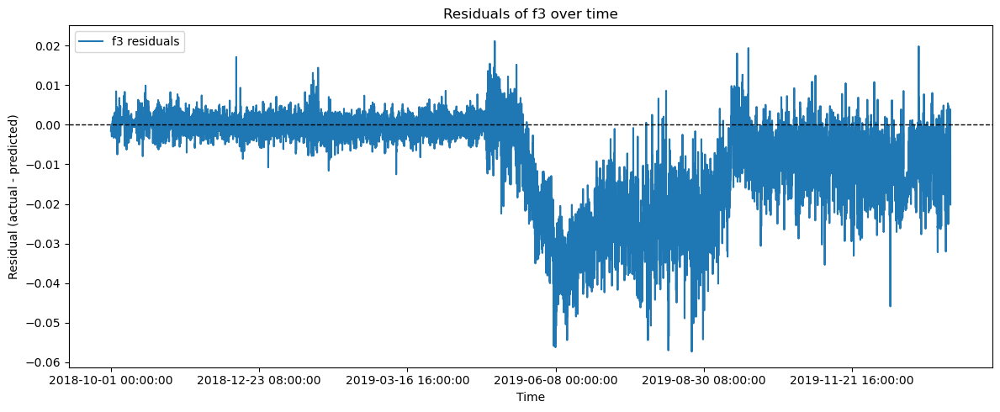
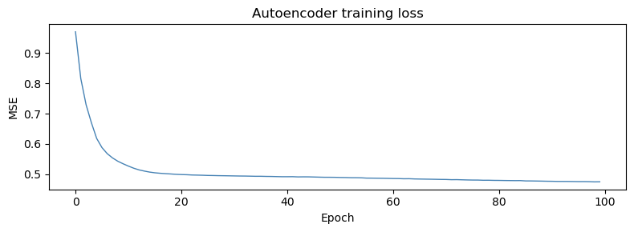
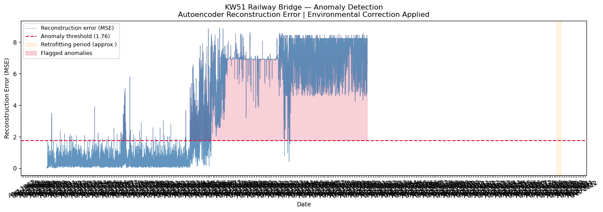

``` python
import pandas as pd
```

<!-- WARNING: THIS FILE WAS AUTOGENERATED! DO NOT EDIT! -->

``` python
df = pd.read_csv(r'E:\SHM_ML\data\cleaned\cleaned_data.csv', index_col=0)
```

``` python
df
```

<div>
<style scoped>
    .dataframe tbody tr th:only-of-type {
        vertical-align: middle;
    }
&#10;    .dataframe tbody tr th {
        vertical-align: top;
    }
&#10;    .dataframe thead th {
        text-align: right;
    }
</style>

<table class="dataframe" data-quarto-postprocess="true" data-border="1">
<thead>
<tr style="text-align: right;">
<th data-quarto-table-cell-role="th"></th>
<th data-quarto-table-cell-role="th">f3</th>
<th data-quarto-table-cell-role="th">f5</th>
<th data-quarto-table-cell-role="th">f6</th>
<th data-quarto-table-cell-role="th">f9</th>
<th data-quarto-table-cell-role="th">f10</th>
<th data-quarto-table-cell-role="th">f11</th>
<th data-quarto-table-cell-role="th">f12</th>
<th data-quarto-table-cell-role="th">f13</th>
<th data-quarto-table-cell-role="th">tBD31A</th>
<th data-quarto-table-cell-role="th">rhBD31A</th>
<th data-quarto-table-cell-role="th">tVL</th>
<th data-quarto-table-cell-role="th">rhVL</th>
<th data-quarto-table-cell-role="th">vpVL</th>
<th data-quarto-table-cell-role="th">raVL</th>
<th data-quarto-table-cell-role="th">wsVL</th>
<th data-quarto-table-cell-role="th">wdVL</th>
</tr>
<tr>
<th data-quarto-table-cell-role="th">timestamp</th>
<th data-quarto-table-cell-role="th"></th>
<th data-quarto-table-cell-role="th"></th>
<th data-quarto-table-cell-role="th"></th>
<th data-quarto-table-cell-role="th"></th>
<th data-quarto-table-cell-role="th"></th>
<th data-quarto-table-cell-role="th"></th>
<th data-quarto-table-cell-role="th"></th>
<th data-quarto-table-cell-role="th"></th>
<th data-quarto-table-cell-role="th"></th>
<th data-quarto-table-cell-role="th"></th>
<th data-quarto-table-cell-role="th"></th>
<th data-quarto-table-cell-role="th"></th>
<th data-quarto-table-cell-role="th"></th>
<th data-quarto-table-cell-role="th"></th>
<th data-quarto-table-cell-role="th"></th>
<th data-quarto-table-cell-role="th"></th>
</tr>
</thead>
<tbody>
<tr>
<td data-quarto-table-cell-role="th">2018-10-01 00:00:00</td>
<td>1.892065</td>
<td>2.591636</td>
<td>2.919671</td>
<td>4.104634</td>
<td>4.292805</td>
<td>4.806421</td>
<td>5.324662</td>
<td>6.310306</td>
<td>10.100000</td>
<td>81.000000</td>
<td>10.825000</td>
<td>89.333336</td>
<td>1159.144738</td>
<td>0.0</td>
<td>9.40</td>
<td>293.00</td>
</tr>
<tr>
<td data-quarto-table-cell-role="th">2018-10-01 01:00:00</td>
<td>1.892065</td>
<td>2.591636</td>
<td>2.919671</td>
<td>4.104634</td>
<td>4.292805</td>
<td>4.806421</td>
<td>5.324662</td>
<td>6.310306</td>
<td>10.000000</td>
<td>85.000000</td>
<td>10.241667</td>
<td>92.750000</td>
<td>1157.524605</td>
<td>0.1</td>
<td>10.30</td>
<td>295.00</td>
</tr>
<tr>
<td data-quarto-table-cell-role="th">2018-10-01 02:00:00</td>
<td>1.892065</td>
<td>2.591636</td>
<td>2.919671</td>
<td>4.104634</td>
<td>4.292805</td>
<td>4.806421</td>
<td>5.324662</td>
<td>6.310306</td>
<td>9.900000</td>
<td>91.000000</td>
<td>10.150000</td>
<td>92.000000</td>
<td>1141.142430</td>
<td>0.0</td>
<td>10.40</td>
<td>284.00</td>
</tr>
<tr>
<td data-quarto-table-cell-role="th">2018-10-01 03:00:00</td>
<td>1.892065</td>
<td>2.591636</td>
<td>2.919671</td>
<td>4.104634</td>
<td>4.292805</td>
<td>4.806421</td>
<td>5.324662</td>
<td>6.310306</td>
<td>9.800000</td>
<td>89.000000</td>
<td>10.166666</td>
<td>91.083336</td>
<td>1131.033604</td>
<td>0.3</td>
<td>11.60</td>
<td>296.00</td>
</tr>
<tr>
<td data-quarto-table-cell-role="th">2018-10-01 04:00:00</td>
<td>1.892065</td>
<td>2.591636</td>
<td>2.919671</td>
<td>4.104634</td>
<td>4.292805</td>
<td>4.806421</td>
<td>5.324662</td>
<td>6.310306</td>
<td>9.800000</td>
<td>90.000000</td>
<td>9.558333</td>
<td>93.166664</td>
<td>1110.625906</td>
<td>0.2</td>
<td>9.60</td>
<td>283.00</td>
</tr>
<tr>
<td data-quarto-table-cell-role="th">...</td>
<td>...</td>
<td>...</td>
<td>...</td>
<td>...</td>
<td>...</td>
<td>...</td>
<td>...</td>
<td>...</td>
<td>...</td>
<td>...</td>
<td>...</td>
<td>...</td>
<td>...</td>
<td>...</td>
<td>...</td>
<td>...</td>
</tr>
<tr>
<td data-quarto-table-cell-role="th">2020-01-15 19:00:00</td>
<td>1.888801</td>
<td>2.555565</td>
<td>2.986277</td>
<td>4.078602</td>
<td>4.386448</td>
<td>4.942893</td>
<td>5.440576</td>
<td>6.436793</td>
<td>9.641429</td>
<td>83.304917</td>
<td>8.386441</td>
<td>83.342373</td>
<td>918.137648</td>
<td>0.0</td>
<td>1.96</td>
<td>200.08</td>
</tr>
<tr>
<td data-quarto-table-cell-role="th">2020-01-15 20:00:00</td>
<td>1.887610</td>
<td>2.586921</td>
<td>2.982070</td>
<td>4.080208</td>
<td>4.386448</td>
<td>4.940309</td>
<td>5.426145</td>
<td>6.398893</td>
<td>9.143141</td>
<td>80.168936</td>
<td>7.545000</td>
<td>84.875000</td>
<td>882.549401</td>
<td>0.0</td>
<td>1.51</td>
<td>187.83</td>
</tr>
<tr>
<td data-quarto-table-cell-role="th">2020-01-15 21:00:00</td>
<td>1.886253</td>
<td>2.581889</td>
<td>2.987133</td>
<td>4.078480</td>
<td>4.386448</td>
<td>4.908271</td>
<td>5.432978</td>
<td>6.410531</td>
<td>8.795149</td>
<td>82.076947</td>
<td>6.301667</td>
<td>89.455000</td>
<td>853.705976</td>
<td>0.0</td>
<td>1.07</td>
<td>199.95</td>
</tr>
<tr>
<td data-quarto-table-cell-role="th">2020-01-15 22:00:00</td>
<td>1.888356</td>
<td>2.566954</td>
<td>2.987248</td>
<td>4.080275</td>
<td>4.386448</td>
<td>4.940258</td>
<td>5.449368</td>
<td>6.425065</td>
<td>8.367961</td>
<td>83.432317</td>
<td>5.583333</td>
<td>93.038333</td>
<td>845.126865</td>
<td>0.0</td>
<td>0.91</td>
<td>204.28</td>
</tr>
<tr>
<td data-quarto-table-cell-role="th">2020-01-15 23:00:00</td>
<td>1.871882</td>
<td>2.566954</td>
<td>2.987134</td>
<td>4.077780</td>
<td>4.386448</td>
<td>4.940258</td>
<td>5.449368</td>
<td>6.425065</td>
<td>7.936330</td>
<td>85.265024</td>
<td>5.486667</td>
<td>92.815000</td>
<td>837.557894</td>
<td>0.0</td>
<td>0.90</td>
<td>201.26</td>
</tr>
</tbody>
</table>

<p>11328 rows × 16 columns</p>
</div>

``` python
df_sperate = df['2018-10-01':'2019-04-30']
```

``` python
df_sperate
```

<div>
<style scoped>
    .dataframe tbody tr th:only-of-type {
        vertical-align: middle;
    }
&#10;    .dataframe tbody tr th {
        vertical-align: top;
    }
&#10;    .dataframe thead th {
        text-align: right;
    }
</style>

<table class="dataframe" data-quarto-postprocess="true" data-border="1">
<thead>
<tr style="text-align: right;">
<th data-quarto-table-cell-role="th"></th>
<th data-quarto-table-cell-role="th">f3</th>
<th data-quarto-table-cell-role="th">f5</th>
<th data-quarto-table-cell-role="th">f6</th>
<th data-quarto-table-cell-role="th">f9</th>
<th data-quarto-table-cell-role="th">f10</th>
<th data-quarto-table-cell-role="th">f11</th>
<th data-quarto-table-cell-role="th">f12</th>
<th data-quarto-table-cell-role="th">f13</th>
<th data-quarto-table-cell-role="th">tBD31A</th>
<th data-quarto-table-cell-role="th">rhBD31A</th>
<th data-quarto-table-cell-role="th">tVL</th>
<th data-quarto-table-cell-role="th">rhVL</th>
<th data-quarto-table-cell-role="th">vpVL</th>
<th data-quarto-table-cell-role="th">raVL</th>
<th data-quarto-table-cell-role="th">wsVL</th>
<th data-quarto-table-cell-role="th">wdVL</th>
</tr>
<tr>
<th data-quarto-table-cell-role="th">timestamp</th>
<th data-quarto-table-cell-role="th"></th>
<th data-quarto-table-cell-role="th"></th>
<th data-quarto-table-cell-role="th"></th>
<th data-quarto-table-cell-role="th"></th>
<th data-quarto-table-cell-role="th"></th>
<th data-quarto-table-cell-role="th"></th>
<th data-quarto-table-cell-role="th"></th>
<th data-quarto-table-cell-role="th"></th>
<th data-quarto-table-cell-role="th"></th>
<th data-quarto-table-cell-role="th"></th>
<th data-quarto-table-cell-role="th"></th>
<th data-quarto-table-cell-role="th"></th>
<th data-quarto-table-cell-role="th"></th>
<th data-quarto-table-cell-role="th"></th>
<th data-quarto-table-cell-role="th"></th>
<th data-quarto-table-cell-role="th"></th>
</tr>
</thead>
<tbody>
<tr>
<td data-quarto-table-cell-role="th">2018-10-01 00:00:00</td>
<td>1.892065</td>
<td>2.591636</td>
<td>2.919671</td>
<td>4.104634</td>
<td>4.292805</td>
<td>4.806421</td>
<td>5.324662</td>
<td>6.310306</td>
<td>10.100000</td>
<td>81.000000</td>
<td>10.825000</td>
<td>89.333336</td>
<td>1159.144738</td>
<td>0.0</td>
<td>9.400000</td>
<td>293.000000</td>
</tr>
<tr>
<td data-quarto-table-cell-role="th">2018-10-01 01:00:00</td>
<td>1.892065</td>
<td>2.591636</td>
<td>2.919671</td>
<td>4.104634</td>
<td>4.292805</td>
<td>4.806421</td>
<td>5.324662</td>
<td>6.310306</td>
<td>10.000000</td>
<td>85.000000</td>
<td>10.241667</td>
<td>92.750000</td>
<td>1157.524605</td>
<td>0.1</td>
<td>10.300000</td>
<td>295.000000</td>
</tr>
<tr>
<td data-quarto-table-cell-role="th">2018-10-01 02:00:00</td>
<td>1.892065</td>
<td>2.591636</td>
<td>2.919671</td>
<td>4.104634</td>
<td>4.292805</td>
<td>4.806421</td>
<td>5.324662</td>
<td>6.310306</td>
<td>9.900000</td>
<td>91.000000</td>
<td>10.150000</td>
<td>92.000000</td>
<td>1141.142430</td>
<td>0.0</td>
<td>10.400000</td>
<td>284.000000</td>
</tr>
<tr>
<td data-quarto-table-cell-role="th">2018-10-01 03:00:00</td>
<td>1.892065</td>
<td>2.591636</td>
<td>2.919671</td>
<td>4.104634</td>
<td>4.292805</td>
<td>4.806421</td>
<td>5.324662</td>
<td>6.310306</td>
<td>9.800000</td>
<td>89.000000</td>
<td>10.166666</td>
<td>91.083336</td>
<td>1131.033604</td>
<td>0.3</td>
<td>11.600000</td>
<td>296.000000</td>
</tr>
<tr>
<td data-quarto-table-cell-role="th">2018-10-01 04:00:00</td>
<td>1.892065</td>
<td>2.591636</td>
<td>2.919671</td>
<td>4.104634</td>
<td>4.292805</td>
<td>4.806421</td>
<td>5.324662</td>
<td>6.310306</td>
<td>9.800000</td>
<td>90.000000</td>
<td>9.558333</td>
<td>93.166664</td>
<td>1110.625906</td>
<td>0.2</td>
<td>9.600000</td>
<td>283.000000</td>
</tr>
<tr>
<td data-quarto-table-cell-role="th">...</td>
<td>...</td>
<td>...</td>
<td>...</td>
<td>...</td>
<td>...</td>
<td>...</td>
<td>...</td>
<td>...</td>
<td>...</td>
<td>...</td>
<td>...</td>
<td>...</td>
<td>...</td>
<td>...</td>
<td>...</td>
<td>...</td>
</tr>
<tr>
<td data-quarto-table-cell-role="th">2019-04-29 19:00:00</td>
<td>1.890049</td>
<td>2.594095</td>
<td>2.917152</td>
<td>4.101670</td>
<td>4.293515</td>
<td>4.813300</td>
<td>5.305633</td>
<td>6.288173</td>
<td>14.994566</td>
<td>61.665304</td>
<td>13.178333</td>
<td>67.000000</td>
<td>1015.313621</td>
<td>0.0</td>
<td>2.696087</td>
<td>314.663666</td>
</tr>
<tr>
<td data-quarto-table-cell-role="th">2019-04-29 20:00:00</td>
<td>1.895998</td>
<td>2.574052</td>
<td>2.911005</td>
<td>4.107677</td>
<td>4.293515</td>
<td>4.813300</td>
<td>5.305633</td>
<td>6.298710</td>
<td>14.102020</td>
<td>63.418778</td>
<td>12.211667</td>
<td>70.000000</td>
<td>995.619229</td>
<td>0.0</td>
<td>2.539050</td>
<td>319.833069</td>
</tr>
<tr>
<td data-quarto-table-cell-role="th">2019-04-29 21:00:00</td>
<td>1.890448</td>
<td>2.594953</td>
<td>2.916761</td>
<td>4.103926</td>
<td>4.293515</td>
<td>4.839047</td>
<td>5.323376</td>
<td>6.293116</td>
<td>13.356834</td>
<td>68.153272</td>
<td>11.321667</td>
<td>75.833336</td>
<td>1016.990289</td>
<td>0.0</td>
<td>2.156045</td>
<td>321.044067</td>
</tr>
<tr>
<td data-quarto-table-cell-role="th">2019-04-29 22:00:00</td>
<td>1.898450</td>
<td>2.572051</td>
<td>2.915515</td>
<td>4.103987</td>
<td>4.296567</td>
<td>4.808872</td>
<td>5.323376</td>
<td>6.292831</td>
<td>12.641192</td>
<td>72.711270</td>
<td>10.961667</td>
<td>79.750000</td>
<td>1044.249919</td>
<td>0.0</td>
<td>2.207700</td>
<td>321.026398</td>
</tr>
<tr>
<td data-quarto-table-cell-role="th">2019-04-29 23:00:00</td>
<td>1.886158</td>
<td>2.544016</td>
<td>2.915863</td>
<td>4.103814</td>
<td>4.285237</td>
<td>4.808872</td>
<td>5.323376</td>
<td>6.292710</td>
<td>12.074313</td>
<td>76.718851</td>
<td>10.776667</td>
<td>82.416664</td>
<td>1065.960906</td>
<td>0.0</td>
<td>2.163316</td>
<td>343.520081</td>
</tr>
</tbody>
</table>

<p>5064 rows × 16 columns</p>
</div>

``` python
freq_cols = ['f3', 'f5', 'f6', 'f9', 'f10', 'f11', 'f12', 'f13']
env_cols = ['tBD31A', 'rhBD31A', 'tVL', 'rhVL', 'vpVL', 'raVL', 'wsVL', 'wdVL']

# Training slice — pre-damage normal period
x_train = df[env_cols].loc['2018-10-01':'2019-04-30']
y_train = df[freq_cols].loc['2018-10-01':'2019-04-30']

# Train one Random Forest per frequency
from sklearn.ensemble import RandomForestRegressor

# Train one model per frequency mode
models = {}
for col in freq_cols:
    rf = RandomForestRegressor(n_estimators=100, random_state=42, n_jobs=-1)
    rf.fit(x_train, y_train[col])
    models[col] = rf
    print(f"Trained model for {col}")

print("\nAll models trained.")


# Predict for ENTIRE dataset
predictions = {}
for col in freq_cols:
    predictions[col] = models[col].predict(df[env_cols])

pred_df = pd.DataFrame(predictions, index=df.index)

# Residuals for ENTIRE dataset
residuals_df = df[freq_cols] - pred_df
```

    Trained model for f3
    Trained model for f5
    Trained model for f6
    Trained model for f9
    Trained model for f10
    Trained model for f11
    Trained model for f12
    Trained model for f13

    All models trained.

``` python
print(residuals_df.head())
```

                               f3        f5        f6        f9       f10  \
    timestamp                                                               
    2018-10-01 00:00:00 -0.001569  0.000602 -0.000643 -0.001125 -0.001464   
    2018-10-01 01:00:00 -0.001015  0.000557 -0.000220 -0.000751 -0.000483   
    2018-10-01 02:00:00 -0.000645  0.000290 -0.000222 -0.000613 -0.001403   
    2018-10-01 03:00:00 -0.000786  0.000347 -0.000296 -0.000762 -0.001085   
    2018-10-01 04:00:00 -0.000882  0.001238 -0.000511  0.000023 -0.000863   

                              f11       f12       f13  
    timestamp                                          
    2018-10-01 00:00:00 -0.012923  0.000804 -0.001559  
    2018-10-01 01:00:00 -0.010297  0.000630 -0.000072  
    2018-10-01 02:00:00 -0.011089  0.000354 -0.001643  
    2018-10-01 03:00:00 -0.002750 -0.000367 -0.001405  
    2018-10-01 04:00:00 -0.003769  0.000116 -0.000110  

``` python
import matplotlib.pyplot as plt

plt.figure(figsize=(12, 5))
residuals_df['f3'].plot(label='f3 residuals')
plt.axhline(0, color='k', linestyle='--', linewidth=1)
plt.title('Residuals of f3 over time')
plt.xlabel('Time')
plt.ylabel('Residual (actual - predicted)')
plt.legend()
plt.tight_layout()
plt.show()
```



``` python
# imports
# ===== 1. Imports =====
import numpy as np
from sklearn.preprocessing import StandardScaler
from tensorflow.keras.models import Sequential
from tensorflow.keras.layers import Dense

# ── Clip residuals at ±3 std (training period stats only) ───────────────────
train_period = residuals_df.loc['2018-10-01':'2019-04-30']
train_mean   = train_period.mean()
train_std    = train_period.std()

lower = train_mean - 3 * train_std
upper = train_mean + 3 * train_std

residuals_clipped = residuals_df.clip(lower=lower, upper=upper, axis=1)

# ── Prepare train / full arrays ──────────────────────────────────────────────
X_full  = residuals_clipped.values
X_train = residuals_clipped.loc['2018-10-01':'2019-04-30'].values

# ── Scale ────────────────────────────────────────────────────────────────────
scaler       = StandardScaler()
X_train_sc   = scaler.fit_transform(X_train)   # fit on normal period only
X_full_sc    = scaler.transform(X_full)         # apply same scaling to full data

print(f"Training samples : {X_train_sc.shape[0]}")
print(f"Full samples     : {X_full_sc.shape[0]}")
# ── Build autoencoder ────────────────────────────────────────────────────────
model = Sequential([
    Dense(6, activation='relu', input_shape=(8,)),   # encoder
    Dense(3, activation='relu'),                      # bottleneck
    Dense(6, activation='relu'),                      # decoder
    Dense(8, activation='linear')                     # reconstruction
])

model.compile(optimizer='adam', loss='mse')
model.summary()
```

    Training samples : 5064
    Full samples     : 11328

    c:\Users\forla\anaconda3\Lib\site-packages\keras\src\layers\core\dense.py:95: UserWarning: Do not pass an `input_shape`/`input_dim` argument to a layer. When using Sequential models, prefer using an `Input(shape)` object as the first layer in the model instead.
      super().__init__(activity_regularizer=activity_regularizer, **kwargs)

<pre style="white-space:pre;overflow-x:auto;line-height:normal;font-family:Menlo,'DejaVu Sans Mono',consolas,'Courier New',monospace"><span style="font-weight: bold">Model: "sequential"</span>
</pre>

<pre style="white-space:pre;overflow-x:auto;line-height:normal;font-family:Menlo,'DejaVu Sans Mono',consolas,'Courier New',monospace">┏━━━━━━━━━━━━━━━━━━━━━━━━━━━━━━━━━┳━━━━━━━━━━━━━━━━━━━━━━━━┳━━━━━━━━━━━━━━━┓
┃<span style="font-weight: bold"> Layer (type)                    </span>┃<span style="font-weight: bold"> Output Shape           </span>┃<span style="font-weight: bold">       Param # </span>┃
┡━━━━━━━━━━━━━━━━━━━━━━━━━━━━━━━━━╇━━━━━━━━━━━━━━━━━━━━━━━━╇━━━━━━━━━━━━━━━┩
│ dense (<span style="color: #0087ff; text-decoration-color: #0087ff">Dense</span>)                   │ (<span style="color: #00d7ff; text-decoration-color: #00d7ff">None</span>, <span style="color: #00af00; text-decoration-color: #00af00">6</span>)              │            <span style="color: #00af00; text-decoration-color: #00af00">54</span> │
├─────────────────────────────────┼────────────────────────┼───────────────┤
│ dense_1 (<span style="color: #0087ff; text-decoration-color: #0087ff">Dense</span>)                 │ (<span style="color: #00d7ff; text-decoration-color: #00d7ff">None</span>, <span style="color: #00af00; text-decoration-color: #00af00">3</span>)              │            <span style="color: #00af00; text-decoration-color: #00af00">21</span> │
├─────────────────────────────────┼────────────────────────┼───────────────┤
│ dense_2 (<span style="color: #0087ff; text-decoration-color: #0087ff">Dense</span>)                 │ (<span style="color: #00d7ff; text-decoration-color: #00d7ff">None</span>, <span style="color: #00af00; text-decoration-color: #00af00">6</span>)              │            <span style="color: #00af00; text-decoration-color: #00af00">24</span> │
├─────────────────────────────────┼────────────────────────┼───────────────┤
│ dense_3 (<span style="color: #0087ff; text-decoration-color: #0087ff">Dense</span>)                 │ (<span style="color: #00d7ff; text-decoration-color: #00d7ff">None</span>, <span style="color: #00af00; text-decoration-color: #00af00">8</span>)              │            <span style="color: #00af00; text-decoration-color: #00af00">56</span> │
└─────────────────────────────────┴────────────────────────┴───────────────┘
</pre>

<pre style="white-space:pre;overflow-x:auto;line-height:normal;font-family:Menlo,'DejaVu Sans Mono',consolas,'Courier New',monospace"><span style="font-weight: bold"> Total params: </span><span style="color: #00af00; text-decoration-color: #00af00">155</span> (620.00 B)
</pre>

<pre style="white-space:pre;overflow-x:auto;line-height:normal;font-family:Menlo,'DejaVu Sans Mono',consolas,'Courier New',monospace"><span style="font-weight: bold"> Trainable params: </span><span style="color: #00af00; text-decoration-color: #00af00">155</span> (620.00 B)
</pre>

<pre style="white-space:pre;overflow-x:auto;line-height:normal;font-family:Menlo,'DejaVu Sans Mono',consolas,'Courier New',monospace"><span style="font-weight: bold"> Non-trainable params: </span><span style="color: #00af00; text-decoration-color: #00af00">0</span> (0.00 B)
</pre>

``` python
# ── Build autoencoder ────────────────────────────────────────────────────────
model = Sequential([
    Dense(6, activation='relu', input_shape=(8,)),   # encoder
    Dense(3, activation='relu'),                      # bottleneck
    Dense(6, activation='relu'),                      # decoder
    Dense(8, activation='linear')                     # reconstruction
])

model.compile(optimizer='adam', loss='mse')
model.summary()
```

<pre style="white-space:pre;overflow-x:auto;line-height:normal;font-family:Menlo,'DejaVu Sans Mono',consolas,'Courier New',monospace"><span style="font-weight: bold">Model: "sequential_1"</span>
</pre>

<pre style="white-space:pre;overflow-x:auto;line-height:normal;font-family:Menlo,'DejaVu Sans Mono',consolas,'Courier New',monospace">┏━━━━━━━━━━━━━━━━━━━━━━━━━━━━━━━━━┳━━━━━━━━━━━━━━━━━━━━━━━━┳━━━━━━━━━━━━━━━┓
┃<span style="font-weight: bold"> Layer (type)                    </span>┃<span style="font-weight: bold"> Output Shape           </span>┃<span style="font-weight: bold">       Param # </span>┃
┡━━━━━━━━━━━━━━━━━━━━━━━━━━━━━━━━━╇━━━━━━━━━━━━━━━━━━━━━━━━╇━━━━━━━━━━━━━━━┩
│ dense_4 (<span style="color: #0087ff; text-decoration-color: #0087ff">Dense</span>)                 │ (<span style="color: #00d7ff; text-decoration-color: #00d7ff">None</span>, <span style="color: #00af00; text-decoration-color: #00af00">6</span>)              │            <span style="color: #00af00; text-decoration-color: #00af00">54</span> │
├─────────────────────────────────┼────────────────────────┼───────────────┤
│ dense_5 (<span style="color: #0087ff; text-decoration-color: #0087ff">Dense</span>)                 │ (<span style="color: #00d7ff; text-decoration-color: #00d7ff">None</span>, <span style="color: #00af00; text-decoration-color: #00af00">3</span>)              │            <span style="color: #00af00; text-decoration-color: #00af00">21</span> │
├─────────────────────────────────┼────────────────────────┼───────────────┤
│ dense_6 (<span style="color: #0087ff; text-decoration-color: #0087ff">Dense</span>)                 │ (<span style="color: #00d7ff; text-decoration-color: #00d7ff">None</span>, <span style="color: #00af00; text-decoration-color: #00af00">6</span>)              │            <span style="color: #00af00; text-decoration-color: #00af00">24</span> │
├─────────────────────────────────┼────────────────────────┼───────────────┤
│ dense_7 (<span style="color: #0087ff; text-decoration-color: #0087ff">Dense</span>)                 │ (<span style="color: #00d7ff; text-decoration-color: #00d7ff">None</span>, <span style="color: #00af00; text-decoration-color: #00af00">8</span>)              │            <span style="color: #00af00; text-decoration-color: #00af00">56</span> │
└─────────────────────────────────┴────────────────────────┴───────────────┘
</pre>

<pre style="white-space:pre;overflow-x:auto;line-height:normal;font-family:Menlo,'DejaVu Sans Mono',consolas,'Courier New',monospace"><span style="font-weight: bold"> Total params: </span><span style="color: #00af00; text-decoration-color: #00af00">155</span> (620.00 B)
</pre>

<pre style="white-space:pre;overflow-x:auto;line-height:normal;font-family:Menlo,'DejaVu Sans Mono',consolas,'Courier New',monospace"><span style="font-weight: bold"> Trainable params: </span><span style="color: #00af00; text-decoration-color: #00af00">155</span> (620.00 B)
</pre>

<pre style="white-space:pre;overflow-x:auto;line-height:normal;font-family:Menlo,'DejaVu Sans Mono',consolas,'Courier New',monospace"><span style="font-weight: bold"> Non-trainable params: </span><span style="color: #00af00; text-decoration-color: #00af00">0</span> (0.00 B)
</pre>

``` python
# ── Train ────────────────────────────────────────────────────────────────────
# Input and target are the same — the model learns to reconstruct its input
history = model.fit(
    X_train_sc, X_train_sc,
    epochs=100,
    batch_size=32,
    verbose=1
)

print(f"\nFinal training loss: {history.history['loss'][-1]:.4f}")
```

    Epoch 1/100
    159/159 ━━━━━━━━━━━━━━━━━━━━ 2s 2ms/step - loss: 0.9697
    Epoch 2/100
    159/159 ━━━━━━━━━━━━━━━━━━━━ 0s 2ms/step - loss: 0.8157
    Epoch 3/100
    159/159 ━━━━━━━━━━━━━━━━━━━━ 1s 3ms/step - loss: 0.7294
    Epoch 4/100
    159/159 ━━━━━━━━━━━━━━━━━━━━ 0s 2ms/step - loss: 0.6702
    Epoch 5/100
    159/159 ━━━━━━━━━━━━━━━━━━━━ 0s 3ms/step - loss: 0.6183
    Epoch 6/100
    159/159 ━━━━━━━━━━━━━━━━━━━━ 1s 3ms/step - loss: 0.5882
    Epoch 7/100
    159/159 ━━━━━━━━━━━━━━━━━━━━ 0s 2ms/step - loss: 0.5681
    Epoch 8/100
    159/159 ━━━━━━━━━━━━━━━━━━━━ 1s 4ms/step - loss: 0.5541
    Epoch 9/100
    159/159 ━━━━━━━━━━━━━━━━━━━━ 0s 2ms/step - loss: 0.5431
    Epoch 10/100
    159/159 ━━━━━━━━━━━━━━━━━━━━ 0s 2ms/step - loss: 0.5348
    Epoch 11/100
    159/159 ━━━━━━━━━━━━━━━━━━━━ 1s 3ms/step - loss: 0.5272
    Epoch 12/100
    159/159 ━━━━━━━━━━━━━━━━━━━━ 1s 4ms/step - loss: 0.5202
    Epoch 13/100
    159/159 ━━━━━━━━━━━━━━━━━━━━ 0s 2ms/step - loss: 0.5147
    Epoch 14/100
    159/159 ━━━━━━━━━━━━━━━━━━━━ 0s 2ms/step - loss: 0.5108
    Epoch 15/100
    159/159 ━━━━━━━━━━━━━━━━━━━━ 1s 4ms/step - loss: 0.5075
    Epoch 16/100
    159/159 ━━━━━━━━━━━━━━━━━━━━ 1s 4ms/step - loss: 0.5051
    Epoch 17/100
    159/159 ━━━━━━━━━━━━━━━━━━━━ 1s 3ms/step - loss: 0.5035
    Epoch 18/100
    159/159 ━━━━━━━━━━━━━━━━━━━━ 1s 3ms/step - loss: 0.5023
    Epoch 19/100
    159/159 ━━━━━━━━━━━━━━━━━━━━ 1s 3ms/step - loss: 0.5013
    Epoch 20/100
    159/159 ━━━━━━━━━━━━━━━━━━━━ 1s 3ms/step - loss: 0.5001
    Epoch 21/100
    159/159 ━━━━━━━━━━━━━━━━━━━━ 1s 3ms/step - loss: 0.4993
    Epoch 22/100
    159/159 ━━━━━━━━━━━━━━━━━━━━ 1s 3ms/step - loss: 0.4988
    Epoch 23/100
    159/159 ━━━━━━━━━━━━━━━━━━━━ 0s 2ms/step - loss: 0.4979
    Epoch 24/100
    159/159 ━━━━━━━━━━━━━━━━━━━━ 1s 3ms/step - loss: 0.4975
    Epoch 25/100
    159/159 ━━━━━━━━━━━━━━━━━━━━ 1s 2ms/step - loss: 0.4970
    Epoch 26/100
    159/159 ━━━━━━━━━━━━━━━━━━━━ 1s 2ms/step - loss: 0.4964
    Epoch 27/100
    159/159 ━━━━━━━━━━━━━━━━━━━━ 0s 2ms/step - loss: 0.4961
    Epoch 28/100
    159/159 ━━━━━━━━━━━━━━━━━━━━ 1s 2ms/step - loss: 0.4957
    Epoch 29/100
    159/159 ━━━━━━━━━━━━━━━━━━━━ 1s 2ms/step - loss: 0.4954
    Epoch 30/100
    159/159 ━━━━━━━━━━━━━━━━━━━━ 1s 2ms/step - loss: 0.4951
    Epoch 31/100
    159/159 ━━━━━━━━━━━━━━━━━━━━ 1s 2ms/step - loss: 0.4948
    Epoch 32/100
    159/159 ━━━━━━━━━━━━━━━━━━━━ 1s 3ms/step - loss: 0.4945
    Epoch 33/100
    159/159 ━━━━━━━━━━━━━━━━━━━━ 1s 2ms/step - loss: 0.4943
    Epoch 34/100
    159/159 ━━━━━━━━━━━━━━━━━━━━ 0s 2ms/step - loss: 0.4940
    Epoch 35/100
    159/159 ━━━━━━━━━━━━━━━━━━━━ 1s 3ms/step - loss: 0.4936
    Epoch 36/100
    159/159 ━━━━━━━━━━━━━━━━━━━━ 1s 3ms/step - loss: 0.4936
    Epoch 37/100
    159/159 ━━━━━━━━━━━━━━━━━━━━ 1s 3ms/step - loss: 0.4932
    Epoch 38/100
    159/159 ━━━━━━━━━━━━━━━━━━━━ 0s 2ms/step - loss: 0.4930
    Epoch 39/100
    159/159 ━━━━━━━━━━━━━━━━━━━━ 1s 2ms/step - loss: 0.4926
    Epoch 40/100
    159/159 ━━━━━━━━━━━━━━━━━━━━ 1s 3ms/step - loss: 0.4922
    Epoch 41/100
    159/159 ━━━━━━━━━━━━━━━━━━━━ 1s 3ms/step - loss: 0.4922
    Epoch 42/100
    159/159 ━━━━━━━━━━━━━━━━━━━━ 1s 2ms/step - loss: 0.4923
    Epoch 43/100
    159/159 ━━━━━━━━━━━━━━━━━━━━ 0s 2ms/step - loss: 0.4916
    Epoch 44/100
    159/159 ━━━━━━━━━━━━━━━━━━━━ 1s 4ms/step - loss: 0.4918
    Epoch 45/100
    159/159 ━━━━━━━━━━━━━━━━━━━━ 1s 3ms/step - loss: 0.4917
    Epoch 46/100
    159/159 ━━━━━━━━━━━━━━━━━━━━ 1s 3ms/step - loss: 0.4913
    Epoch 47/100
    159/159 ━━━━━━━━━━━━━━━━━━━━ 1s 3ms/step - loss: 0.4908
    Epoch 48/100
    159/159 ━━━━━━━━━━━━━━━━━━━━ 1s 2ms/step - loss: 0.4904
    Epoch 49/100
    159/159 ━━━━━━━━━━━━━━━━━━━━ 1s 3ms/step - loss: 0.4903
    Epoch 50/100
    159/159 ━━━━━━━━━━━━━━━━━━━━ 1s 3ms/step - loss: 0.4902
    Epoch 51/100
    159/159 ━━━━━━━━━━━━━━━━━━━━ 1s 2ms/step - loss: 0.4897
    Epoch 52/100
    159/159 ━━━━━━━━━━━━━━━━━━━━ 1s 2ms/step - loss: 0.4895
    Epoch 53/100
    159/159 ━━━━━━━━━━━━━━━━━━━━ 0s 2ms/step - loss: 0.4890
    Epoch 54/100
    159/159 ━━━━━━━━━━━━━━━━━━━━ 1s 3ms/step - loss: 0.4889
    Epoch 55/100
    159/159 ━━━━━━━━━━━━━━━━━━━━ 1s 3ms/step - loss: 0.4885
    Epoch 56/100
    159/159 ━━━━━━━━━━━━━━━━━━━━ 0s 2ms/step - loss: 0.4876
    Epoch 57/100
    159/159 ━━━━━━━━━━━━━━━━━━━━ 1s 3ms/step - loss: 0.4875
    Epoch 58/100
    159/159 ━━━━━━━━━━━━━━━━━━━━ 1s 2ms/step - loss: 0.4872
    Epoch 59/100
    159/159 ━━━━━━━━━━━━━━━━━━━━ 0s 3ms/step - loss: 0.4870
    Epoch 60/100
    159/159 ━━━━━━━━━━━━━━━━━━━━ 1s 2ms/step - loss: 0.4866
    Epoch 61/100
    159/159 ━━━━━━━━━━━━━━━━━━━━ 1s 2ms/step - loss: 0.4862
    Epoch 62/100
    159/159 ━━━━━━━━━━━━━━━━━━━━ 1s 2ms/step - loss: 0.4861
    Epoch 63/100
    159/159 ━━━━━━━━━━━━━━━━━━━━ 0s 2ms/step - loss: 0.4855
    Epoch 64/100
    159/159 ━━━━━━━━━━━━━━━━━━━━ 1s 3ms/step - loss: 0.4856
    Epoch 65/100
    159/159 ━━━━━━━━━━━━━━━━━━━━ 1s 2ms/step - loss: 0.4849
    Epoch 66/100
    159/159 ━━━━━━━━━━━━━━━━━━━━ 0s 2ms/step - loss: 0.4845
    Epoch 67/100
    159/159 ━━━━━━━━━━━━━━━━━━━━ 1s 2ms/step - loss: 0.4842
    Epoch 68/100
    159/159 ━━━━━━━━━━━━━━━━━━━━ 0s 2ms/step - loss: 0.4840
    Epoch 69/100
    159/159 ━━━━━━━━━━━━━━━━━━━━ 1s 3ms/step - loss: 0.4837
    Epoch 70/100
    159/159 ━━━━━━━━━━━━━━━━━━━━ 1s 2ms/step - loss: 0.4833
    Epoch 71/100
    159/159 ━━━━━━━━━━━━━━━━━━━━ 1s 2ms/step - loss: 0.4831
    Epoch 72/100
    159/159 ━━━━━━━━━━━━━━━━━━━━ 1s 3ms/step - loss: 0.4824
    Epoch 73/100
    159/159 ━━━━━━━━━━━━━━━━━━━━ 0s 2ms/step - loss: 0.4826
    Epoch 74/100
    159/159 ━━━━━━━━━━━━━━━━━━━━ 1s 2ms/step - loss: 0.4820
    Epoch 75/100
    159/159 ━━━━━━━━━━━━━━━━━━━━ 1s 3ms/step - loss: 0.4816
    Epoch 76/100
    159/159 ━━━━━━━━━━━━━━━━━━━━ 0s 2ms/step - loss: 0.4812
    Epoch 77/100
    159/159 ━━━━━━━━━━━━━━━━━━━━ 1s 4ms/step - loss: 0.4811
    Epoch 78/100
    159/159 ━━━━━━━━━━━━━━━━━━━━ 1s 3ms/step - loss: 0.4805
    Epoch 79/100
    159/159 ━━━━━━━━━━━━━━━━━━━━ 1s 2ms/step - loss: 0.4806
    Epoch 80/100
    159/159 ━━━━━━━━━━━━━━━━━━━━ 1s 2ms/step - loss: 0.4802
    Epoch 81/100
    159/159 ━━━━━━━━━━━━━━━━━━━━ 1s 4ms/step - loss: 0.4800
    Epoch 82/100
    159/159 ━━━━━━━━━━━━━━━━━━━━ 1s 3ms/step - loss: 0.4797
    Epoch 83/100
    159/159 ━━━━━━━━━━━━━━━━━━━━ 0s 2ms/step - loss: 0.4795
    Epoch 84/100
    159/159 ━━━━━━━━━━━━━━━━━━━━ 0s 3ms/step - loss: 0.4794
    Epoch 85/100
    159/159 ━━━━━━━━━━━━━━━━━━━━ 1s 2ms/step - loss: 0.4795
    Epoch 86/100
    159/159 ━━━━━━━━━━━━━━━━━━━━ 1s 3ms/step - loss: 0.4784
    Epoch 87/100
    159/159 ━━━━━━━━━━━━━━━━━━━━ 0s 2ms/step - loss: 0.4783
    Epoch 88/100
    159/159 ━━━━━━━━━━━━━━━━━━━━ 0s 2ms/step - loss: 0.4780
    Epoch 89/100
    159/159 ━━━━━━━━━━━━━━━━━━━━ 1s 3ms/step - loss: 0.4777
    Epoch 90/100
    159/159 ━━━━━━━━━━━━━━━━━━━━ 1s 3ms/step - loss: 0.4773
    Epoch 91/100
    159/159 ━━━━━━━━━━━━━━━━━━━━ 1s 2ms/step - loss: 0.4771
    Epoch 92/100
    159/159 ━━━━━━━━━━━━━━━━━━━━ 1s 2ms/step - loss: 0.4767
    Epoch 93/100
    159/159 ━━━━━━━━━━━━━━━━━━━━ 1s 2ms/step - loss: 0.4767
    Epoch 94/100
    159/159 ━━━━━━━━━━━━━━━━━━━━ 1s 3ms/step - loss: 0.4766
    Epoch 95/100
    159/159 ━━━━━━━━━━━━━━━━━━━━ 0s 2ms/step - loss: 0.4764
    Epoch 96/100
    159/159 ━━━━━━━━━━━━━━━━━━━━ 0s 2ms/step - loss: 0.4761
    Epoch 97/100
    159/159 ━━━━━━━━━━━━━━━━━━━━ 1s 3ms/step - loss: 0.4761
    Epoch 98/100
    159/159 ━━━━━━━━━━━━━━━━━━━━ 1s 3ms/step - loss: 0.4759
    Epoch 99/100
    159/159 ━━━━━━━━━━━━━━━━━━━━ 1s 3ms/step - loss: 0.4752
    Epoch 100/100
    159/159 ━━━━━━━━━━━━━━━━━━━━ 0s 2ms/step - loss: 0.4754

    Final training loss: 0.4754

``` python
# ── Training loss curve ──────────────────────────────────────────────────────
fig, ax = plt.subplots(figsize=(8, 3))
ax.plot(history.history['loss'], color='steelblue', linewidth=1)
ax.set_title('Autoencoder training loss')
ax.set_xlabel('Epoch')
ax.set_ylabel('MSE')
plt.tight_layout()
plt.savefig('training_loss.png', dpi=120, bbox_inches='tight')
plt.show()
```



## 14. Reconstruction Error & Anomaly Threshold

For each time point we compute the **mean squared error** between the
actual residual and its reconstruction.  
The anomaly threshold is set at: **mean + 3 × std** of the
training-period reconstruction error.  
This follows the statistical convention that values beyond 3 standard
deviations are genuinely unusual.

``` python
# ── Reconstruct & compute per-sample MSE ─────────────────────────────────────
reconstructed = model.predict(X_full_sc, verbose=0)
mse           = np.mean((X_full_sc - reconstructed) ** 2, axis=1)
mse_series    = pd.Series(mse, index=residuals_clipped.index)

# ── Threshold from training period ───────────────────────────────────────────
train_mse = mse_series['2018-10-01':'2019-04-30']
threshold = train_mse.mean() + 3 * train_mse.std()

anomalies = mse_series[mse_series > threshold]

print(f"Anomaly threshold  : {threshold:.4f}")
print(f"Training MSE mean  : {train_mse.mean():.4f}")
print(f"Training MSE std   : {train_mse.std():.4f}")
print(f"Total flagged      : {len(anomalies):,} / {len(mse_series):,} ({len(anomalies)/len(mse_series)*100:.1f}%)")
```

    Anomaly threshold  : 1.7614
    Training MSE mean  : 0.4750
    Training MSE std   : 0.4288
    Total flagged      : 6,137 / 11,328 (54.2%)

## 15. Results

The plot below shows the reconstruction error over the full 15-month
monitoring period.  
- **Blue line** — MSE at each time point  
- **Red dashed line** — anomaly threshold (mean + 3σ from training
period)  
- **Red shading** — flagged anomaly regions  
- **Orange band** — approximate retrofitting period (May–September 2019)

The model correctly identifies a sustained anomaly corresponding to the
known bridge retrofitting event.  
The post-repair period also shows elevated error because the bridge
settled at a slightly different frequency baseline — consistent with a
physical change in structural state.

``` python
import matplotlib.dates as mdates

fig, ax = plt.subplots(figsize=(14, 5))

ax.plot(mse_series.index, mse_series.values,
        linewidth=0.5, color='steelblue', alpha=0.85, label='Reconstruction error (MSE)')

ax.axhline(y=threshold, color='crimson', linewidth=1.5,
           linestyle='--', label=f'Anomaly threshold ({threshold:.2f})')

ax.axvspan(mdates.date2num(pd.Timestamp('2019-05-01')), mdates.date2num(pd.Timestamp('2019-09-30')),
           alpha=0.12, color='orange', label='Retrofitting period (approx.)')

ax.fill_between(mse_series.index, mse_series.values, threshold,
                where=(mse_series.values > threshold),
                color='crimson', alpha=0.2, label='Flagged anomalies')

ax.set_title(
    'KW51 Railway Bridge — Anomaly Detection\n'
    'Autoencoder Reconstruction Error | Environmental Correction Applied',
    fontsize=12
)
ax.set_xlabel('Date')
ax.set_ylabel('Reconstruction Error (MSE)')
ax.xaxis.set_major_formatter(mdates.DateFormatter('%b %Y'))
ax.xaxis.set_major_locator(mdates.MonthLocator(interval=2))
plt.xticks(rotation=30)
ax.legend(fontsize=9, loc='upper left')
plt.tight_layout()
plt.savefig('anomaly_detection_result.png', dpi=150, bbox_inches='tight')
plt.show()
print("Final plot saved as anomaly_detection_result.png")
```



    Final plot saved as anomaly_detection_result.png

``` python
total   = len(mse_series)
flagged = (mse_series > threshold).sum()

print("=" * 50)
print("  KW51 BRIDGE — ANOMALY DETECTION SUMMARY")
print("=" * 50)
print(f"  Dataset         : KW51 Railway Bridge, Leuven")
print(f"  Monitoring      : Oct 2018 – Jan 2020")
print(f"  Time points     : {total:,} (hourly)")
print(f"  Frequency modes : 8  (f3, f5, f6, f9–f13)")
print(f"  Env. variables  : 8")
print()
print(f"  Training period : Oct 2018 – Apr 2019")
print(f"  Env. correction : Random Forest Regression")
print(f"  Anomaly model   : Dense Autoencoder (8→6→3→6→8)")
print()
print(f"  Threshold       : {threshold:.4f}  (mean + 3σ)")
print(f"  Flagged points  : {flagged:,} / {total:,}  ({flagged/total*100:.1f}%)")
print()
print(f"  Key finding     : Sustained anomaly detected from")
print(f"                    ~May 2019, consistent with known")
print(f"                    bridge retrofitting event.")
print("=" * 50)
```

    ==================================================
      KW51 BRIDGE — ANOMALY DETECTION SUMMARY
    ==================================================
      Dataset         : KW51 Railway Bridge, Leuven
      Monitoring      : Oct 2018 – Jan 2020
      Time points     : 11,328 (hourly)
      Frequency modes : 8  (f3, f5, f6, f9–f13)
      Env. variables  : 8

      Training period : Oct 2018 – Apr 2019
      Env. correction : Random Forest Regression
      Anomaly model   : Dense Autoencoder (8→6→3→6→8)

      Threshold       : 1.7614  (mean + 3σ)
      Flagged points  : 6,137 / 11,328  (54.2%)

      Key finding     : Sustained anomaly detected from
                        ~May 2019, consistent with known
                        bridge retrofitting event.
    ==================================================
