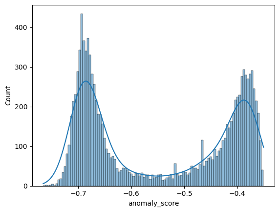
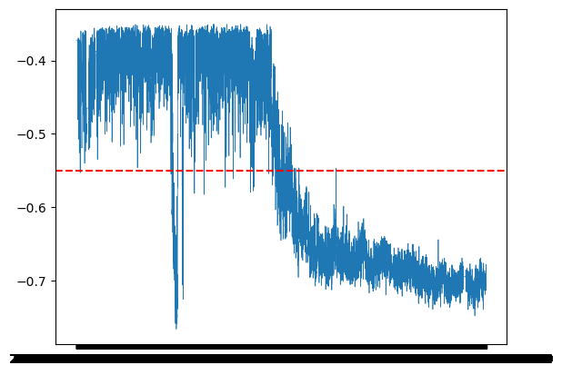
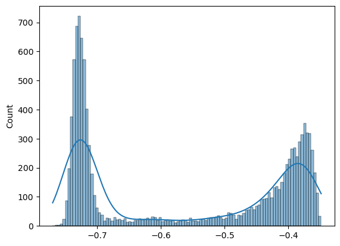
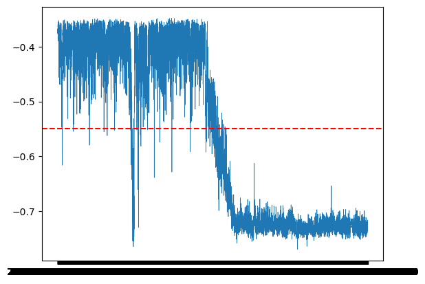

# Isolation Forest for Bridge SHM


<!-- WARNING: THIS FILE WAS AUTOGENERATED! DO NOT EDIT! -->

#### Importing the necessary libraries

``` python
import pandas as pd
```

importing pandas which helps in loading and visualising data set and
manupulating dataset

``` python
import pandas as pd
```

## Introduction

The KW51 railway bridge dataset was obtained from Maes and Lombaert, KU
Leuven. It contains data collected over a 15-month monitoring campaign
between 2018 and 2019, covering pre-damage, retrofitting, and
post-repair periods.

Traditional bridge inspections are manual and not always reliable.
Structural Health Monitoring (SHM) addresses this by installing sensors
directly on the bridge that continuously record its behaviour. In our
case, the sensors record 14 natural frequencies of the bridge along with
environmental variables such as temperature, wind speed, and humidity.

When a bridge sustains damage, its natural frequencies shift. By
detecting anomalies in these frequency readings, we can flag potential
structural damage automatically without manual inspection.

In this notebook, we apply Isolation Forest — an unsupervised machine
learning method — to detect these anomalies in the KW51 dataset.

``` python
df = pd.read_csv(r'E:\SHM_ML\data\cleaned\cleaned_data.csv', index_col=0) # loading data saved earlier
```

``` python
df
```

<div>
<style scoped>
    .dataframe tbody tr th:only-of-type {
        vertical-align: middle;
    }
&#10;    .dataframe tbody tr th {
        vertical-align: top;
    }
&#10;    .dataframe thead th {
        text-align: right;
    }
</style>

<table class="dataframe" data-quarto-postprocess="true" data-border="1">
<thead>
<tr style="text-align: right;">
<th data-quarto-table-cell-role="th"></th>
<th data-quarto-table-cell-role="th">f3</th>
<th data-quarto-table-cell-role="th">f5</th>
<th data-quarto-table-cell-role="th">f6</th>
<th data-quarto-table-cell-role="th">f9</th>
<th data-quarto-table-cell-role="th">f10</th>
<th data-quarto-table-cell-role="th">f11</th>
<th data-quarto-table-cell-role="th">f12</th>
<th data-quarto-table-cell-role="th">f13</th>
<th data-quarto-table-cell-role="th">tBD31A</th>
<th data-quarto-table-cell-role="th">rhBD31A</th>
<th data-quarto-table-cell-role="th">tVL</th>
<th data-quarto-table-cell-role="th">rhVL</th>
<th data-quarto-table-cell-role="th">vpVL</th>
<th data-quarto-table-cell-role="th">raVL</th>
<th data-quarto-table-cell-role="th">wsVL</th>
<th data-quarto-table-cell-role="th">wdVL</th>
</tr>
<tr>
<th data-quarto-table-cell-role="th">timestamp</th>
<th data-quarto-table-cell-role="th"></th>
<th data-quarto-table-cell-role="th"></th>
<th data-quarto-table-cell-role="th"></th>
<th data-quarto-table-cell-role="th"></th>
<th data-quarto-table-cell-role="th"></th>
<th data-quarto-table-cell-role="th"></th>
<th data-quarto-table-cell-role="th"></th>
<th data-quarto-table-cell-role="th"></th>
<th data-quarto-table-cell-role="th"></th>
<th data-quarto-table-cell-role="th"></th>
<th data-quarto-table-cell-role="th"></th>
<th data-quarto-table-cell-role="th"></th>
<th data-quarto-table-cell-role="th"></th>
<th data-quarto-table-cell-role="th"></th>
<th data-quarto-table-cell-role="th"></th>
<th data-quarto-table-cell-role="th"></th>
</tr>
</thead>
<tbody>
<tr>
<td data-quarto-table-cell-role="th">2018-10-01 00:00:00</td>
<td>1.892065</td>
<td>2.591636</td>
<td>2.919671</td>
<td>4.104634</td>
<td>4.292805</td>
<td>4.806421</td>
<td>5.324662</td>
<td>6.310306</td>
<td>10.100000</td>
<td>81.000000</td>
<td>10.825000</td>
<td>89.333336</td>
<td>1159.144738</td>
<td>0.0</td>
<td>9.40</td>
<td>293.00</td>
</tr>
<tr>
<td data-quarto-table-cell-role="th">2018-10-01 01:00:00</td>
<td>1.892065</td>
<td>2.591636</td>
<td>2.919671</td>
<td>4.104634</td>
<td>4.292805</td>
<td>4.806421</td>
<td>5.324662</td>
<td>6.310306</td>
<td>10.000000</td>
<td>85.000000</td>
<td>10.241667</td>
<td>92.750000</td>
<td>1157.524605</td>
<td>0.1</td>
<td>10.30</td>
<td>295.00</td>
</tr>
<tr>
<td data-quarto-table-cell-role="th">2018-10-01 02:00:00</td>
<td>1.892065</td>
<td>2.591636</td>
<td>2.919671</td>
<td>4.104634</td>
<td>4.292805</td>
<td>4.806421</td>
<td>5.324662</td>
<td>6.310306</td>
<td>9.900000</td>
<td>91.000000</td>
<td>10.150000</td>
<td>92.000000</td>
<td>1141.142430</td>
<td>0.0</td>
<td>10.40</td>
<td>284.00</td>
</tr>
<tr>
<td data-quarto-table-cell-role="th">2018-10-01 03:00:00</td>
<td>1.892065</td>
<td>2.591636</td>
<td>2.919671</td>
<td>4.104634</td>
<td>4.292805</td>
<td>4.806421</td>
<td>5.324662</td>
<td>6.310306</td>
<td>9.800000</td>
<td>89.000000</td>
<td>10.166666</td>
<td>91.083336</td>
<td>1131.033604</td>
<td>0.3</td>
<td>11.60</td>
<td>296.00</td>
</tr>
<tr>
<td data-quarto-table-cell-role="th">2018-10-01 04:00:00</td>
<td>1.892065</td>
<td>2.591636</td>
<td>2.919671</td>
<td>4.104634</td>
<td>4.292805</td>
<td>4.806421</td>
<td>5.324662</td>
<td>6.310306</td>
<td>9.800000</td>
<td>90.000000</td>
<td>9.558333</td>
<td>93.166664</td>
<td>1110.625906</td>
<td>0.2</td>
<td>9.60</td>
<td>283.00</td>
</tr>
<tr>
<td data-quarto-table-cell-role="th">...</td>
<td>...</td>
<td>...</td>
<td>...</td>
<td>...</td>
<td>...</td>
<td>...</td>
<td>...</td>
<td>...</td>
<td>...</td>
<td>...</td>
<td>...</td>
<td>...</td>
<td>...</td>
<td>...</td>
<td>...</td>
<td>...</td>
</tr>
<tr>
<td data-quarto-table-cell-role="th">2020-01-15 19:00:00</td>
<td>1.888801</td>
<td>2.555565</td>
<td>2.986277</td>
<td>4.078602</td>
<td>4.386448</td>
<td>4.942893</td>
<td>5.440576</td>
<td>6.436793</td>
<td>9.641429</td>
<td>83.304917</td>
<td>8.386441</td>
<td>83.342373</td>
<td>918.137648</td>
<td>0.0</td>
<td>1.96</td>
<td>200.08</td>
</tr>
<tr>
<td data-quarto-table-cell-role="th">2020-01-15 20:00:00</td>
<td>1.887610</td>
<td>2.586921</td>
<td>2.982070</td>
<td>4.080208</td>
<td>4.386448</td>
<td>4.940309</td>
<td>5.426145</td>
<td>6.398893</td>
<td>9.143141</td>
<td>80.168936</td>
<td>7.545000</td>
<td>84.875000</td>
<td>882.549401</td>
<td>0.0</td>
<td>1.51</td>
<td>187.83</td>
</tr>
<tr>
<td data-quarto-table-cell-role="th">2020-01-15 21:00:00</td>
<td>1.886253</td>
<td>2.581889</td>
<td>2.987133</td>
<td>4.078480</td>
<td>4.386448</td>
<td>4.908271</td>
<td>5.432978</td>
<td>6.410531</td>
<td>8.795149</td>
<td>82.076947</td>
<td>6.301667</td>
<td>89.455000</td>
<td>853.705976</td>
<td>0.0</td>
<td>1.07</td>
<td>199.95</td>
</tr>
<tr>
<td data-quarto-table-cell-role="th">2020-01-15 22:00:00</td>
<td>1.888356</td>
<td>2.566954</td>
<td>2.987248</td>
<td>4.080275</td>
<td>4.386448</td>
<td>4.940258</td>
<td>5.449368</td>
<td>6.425065</td>
<td>8.367961</td>
<td>83.432317</td>
<td>5.583333</td>
<td>93.038333</td>
<td>845.126865</td>
<td>0.0</td>
<td>0.91</td>
<td>204.28</td>
</tr>
<tr>
<td data-quarto-table-cell-role="th">2020-01-15 23:00:00</td>
<td>1.871882</td>
<td>2.566954</td>
<td>2.987134</td>
<td>4.077780</td>
<td>4.386448</td>
<td>4.940258</td>
<td>5.449368</td>
<td>6.425065</td>
<td>7.936330</td>
<td>85.265024</td>
<td>5.486667</td>
<td>92.815000</td>
<td>837.557894</td>
<td>0.0</td>
<td>0.90</td>
<td>201.26</td>
</tr>
</tbody>
</table>

<p>11328 rows × 16 columns</p>
</div>

``` python
import numpy as np
import pandas as pd
from sklearn.ensemble import IsolationForest

# Create dummy data — 100 normal points clustered around 0
# and 5 obvious outliers far away
rng = np.random.seed(42)

normal = np.random.randn(100, 2)        # 100 rows, 2 features, clustered near 0
outliers = np.array([[10, 10],          # these 5 points are far from the cluster
                     [-10, -10],
                     [10, -10],
                     [-10, 10],
                     [8, 8]])

X = np.vstack([normal, outliers])       # stack them into one array, 105 rows total

# Build the model
model = IsolationForest(
    n_estimators=100,      # number of trees in the forest
    max_samples=50,        # how many points each tree is trained on
    contamination=0.05,    # we expect 5% of points to be anomalies (5 out of 105)
    random_state=42        # fixes randomness so results are reproducible
)

# Train the model — it learns what "normal" looks like
model.fit(X)

# Get anomaly scores for every point
# more negative = more anomalous in sklearn's convention
scores = model.score_samples(X)

# Get labels — sklearn returns -1 for anomaly, 1 for normal
labels = model.predict(X)

# Put it all together
results = pd.DataFrame(X, columns=['feature_1', 'feature_2'])
results['anomaly_score'] = scores
results['label'] = labels

print(results.tail(10))  # last 10 rows — should show our 5 outliers flagged
```

         feature_1  feature_2  anomaly_score  label
    95   -0.446515   0.856399      -0.398170      1
    96    0.214094  -1.245739      -0.407782      1
    97    0.173181   0.385317      -0.366962      1
    98   -0.883857   0.153725      -0.385960      1
    99    0.058209  -1.142970      -0.398592      1
    100  10.000000  10.000000      -0.766391     -1
    101 -10.000000 -10.000000      -0.759764     -1
    102  10.000000 -10.000000      -0.762370     -1
    103 -10.000000  10.000000      -0.755891     -1
    104   8.000000   8.000000      -0.748336     -1

``` python
print(pd.DataFrame(X, columns=['feature_1', 'feature_2']).head(10))
```

       feature_1  feature_2
    0   0.496714  -0.138264
    1   0.647689   1.523030
    2  -0.234153  -0.234137
    3   1.579213   0.767435
    4  -0.469474   0.542560
    5  -0.463418  -0.465730
    6   0.241962  -1.913280
    7  -1.724918  -0.562288
    8  -1.012831   0.314247
    9  -0.908024  -1.412304

``` python
df_normal = df['2018-10-01':'2019-04-30']

X = df_normal[["f3", "f5", "f6", "f9", "f10", "f11", "f12", "f13"]]
X.head()
```

<div>
<style scoped>
    .dataframe tbody tr th:only-of-type {
        vertical-align: middle;
    }
&#10;    .dataframe tbody tr th {
        vertical-align: top;
    }
&#10;    .dataframe thead th {
        text-align: right;
    }
</style>

<table class="dataframe" data-quarto-postprocess="true" data-border="1">
<thead>
<tr style="text-align: right;">
<th data-quarto-table-cell-role="th"></th>
<th data-quarto-table-cell-role="th">f3</th>
<th data-quarto-table-cell-role="th">f5</th>
<th data-quarto-table-cell-role="th">f6</th>
<th data-quarto-table-cell-role="th">f9</th>
<th data-quarto-table-cell-role="th">f10</th>
<th data-quarto-table-cell-role="th">f11</th>
<th data-quarto-table-cell-role="th">f12</th>
<th data-quarto-table-cell-role="th">f13</th>
</tr>
<tr>
<th data-quarto-table-cell-role="th">timestamp</th>
<th data-quarto-table-cell-role="th"></th>
<th data-quarto-table-cell-role="th"></th>
<th data-quarto-table-cell-role="th"></th>
<th data-quarto-table-cell-role="th"></th>
<th data-quarto-table-cell-role="th"></th>
<th data-quarto-table-cell-role="th"></th>
<th data-quarto-table-cell-role="th"></th>
<th data-quarto-table-cell-role="th"></th>
</tr>
</thead>
<tbody>
<tr>
<td data-quarto-table-cell-role="th">2018-10-01 00:00:00</td>
<td>1.892065</td>
<td>2.591636</td>
<td>2.919671</td>
<td>4.104634</td>
<td>4.292805</td>
<td>4.806421</td>
<td>5.324662</td>
<td>6.310306</td>
</tr>
<tr>
<td data-quarto-table-cell-role="th">2018-10-01 01:00:00</td>
<td>1.892065</td>
<td>2.591636</td>
<td>2.919671</td>
<td>4.104634</td>
<td>4.292805</td>
<td>4.806421</td>
<td>5.324662</td>
<td>6.310306</td>
</tr>
<tr>
<td data-quarto-table-cell-role="th">2018-10-01 02:00:00</td>
<td>1.892065</td>
<td>2.591636</td>
<td>2.919671</td>
<td>4.104634</td>
<td>4.292805</td>
<td>4.806421</td>
<td>5.324662</td>
<td>6.310306</td>
</tr>
<tr>
<td data-quarto-table-cell-role="th">2018-10-01 03:00:00</td>
<td>1.892065</td>
<td>2.591636</td>
<td>2.919671</td>
<td>4.104634</td>
<td>4.292805</td>
<td>4.806421</td>
<td>5.324662</td>
<td>6.310306</td>
</tr>
<tr>
<td data-quarto-table-cell-role="th">2018-10-01 04:00:00</td>
<td>1.892065</td>
<td>2.591636</td>
<td>2.919671</td>
<td>4.104634</td>
<td>4.292805</td>
<td>4.806421</td>
<td>5.324662</td>
<td>6.310306</td>
</tr>
</tbody>
</table>

</div>

``` python
print(X.shape)
```

    (5064, 8)

``` python
from sklearn.ensemble import IsolationForest

model = IsolationForest(
    n_estimators=100,    
    max_samples=256,     
    contamination=0.1,   
    random_state=42      
)

model.fit(X)
```

<style>#sk-container-id-1 {
  /* Definition of color scheme common for light and dark mode */
  --sklearn-color-text: #000;
  --sklearn-color-text-muted: #666;
  --sklearn-color-line: gray;
  /* Definition of color scheme for unfitted estimators */
  --sklearn-color-unfitted-level-0: #fff5e6;
  --sklearn-color-unfitted-level-1: #f6e4d2;
  --sklearn-color-unfitted-level-2: #ffe0b3;
  --sklearn-color-unfitted-level-3: chocolate;
  /* Definition of color scheme for fitted estimators */
  --sklearn-color-fitted-level-0: #f0f8ff;
  --sklearn-color-fitted-level-1: #d4ebff;
  --sklearn-color-fitted-level-2: #b3dbfd;
  --sklearn-color-fitted-level-3: cornflowerblue;
}
&#10;#sk-container-id-1.light {
  /* Specific color for light theme */
  --sklearn-color-text-on-default-background: black;
  --sklearn-color-background: white;
  --sklearn-color-border-box: black;
  --sklearn-color-icon: #696969;
}
&#10;#sk-container-id-1.dark {
  --sklearn-color-text-on-default-background: white;
  --sklearn-color-background: #111;
  --sklearn-color-border-box: white;
  --sklearn-color-icon: #878787;
}
&#10;#sk-container-id-1 {
  color: var(--sklearn-color-text);
}
&#10;#sk-container-id-1 pre {
  padding: 0;
}
&#10;#sk-container-id-1 input.sk-hidden--visually {
  border: 0;
  clip: rect(1px 1px 1px 1px);
  clip: rect(1px, 1px, 1px, 1px);
  height: 1px;
  margin: -1px;
  overflow: hidden;
  padding: 0;
  position: absolute;
  width: 1px;
}
&#10;#sk-container-id-1 div.sk-dashed-wrapped {
  border: 1px dashed var(--sklearn-color-line);
  margin: 0 0.4em 0.5em 0.4em;
  box-sizing: border-box;
  padding-bottom: 0.4em;
  background-color: var(--sklearn-color-background);
}
&#10;#sk-container-id-1 div.sk-container {
  /* jupyter's `normalize.less` sets `[hidden] { display: none; }`
     but bootstrap.min.css set `[hidden] { display: none !important; }`
     so we also need the `!important` here to be able to override the
     default hidden behavior on the sphinx rendered scikit-learn.org.
     See: https://github.com/scikit-learn/scikit-learn/issues/21755 */
  display: inline-block !important;
  position: relative;
}
&#10;#sk-container-id-1 div.sk-text-repr-fallback {
  display: none;
}
&#10;div.sk-parallel-item,
div.sk-serial,
div.sk-item {
  /* draw centered vertical line to link estimators */
  background-image: linear-gradient(var(--sklearn-color-text-on-default-background), var(--sklearn-color-text-on-default-background));
  background-size: 2px 100%;
  background-repeat: no-repeat;
  background-position: center center;
}
&#10;/* Parallel-specific style estimator block */
&#10;#sk-container-id-1 div.sk-parallel-item::after {
  content: "";
  width: 100%;
  border-bottom: 2px solid var(--sklearn-color-text-on-default-background);
  flex-grow: 1;
}
&#10;#sk-container-id-1 div.sk-parallel {
  display: flex;
  align-items: stretch;
  justify-content: center;
  background-color: var(--sklearn-color-background);
  position: relative;
}
&#10;#sk-container-id-1 div.sk-parallel-item {
  display: flex;
  flex-direction: column;
}
&#10;#sk-container-id-1 div.sk-parallel-item:first-child::after {
  align-self: flex-end;
  width: 50%;
}
&#10;#sk-container-id-1 div.sk-parallel-item:last-child::after {
  align-self: flex-start;
  width: 50%;
}
&#10;#sk-container-id-1 div.sk-parallel-item:only-child::after {
  width: 0;
}
&#10;/* Serial-specific style estimator block */
&#10;#sk-container-id-1 div.sk-serial {
  display: flex;
  flex-direction: column;
  align-items: center;
  background-color: var(--sklearn-color-background);
  padding-right: 1em;
  padding-left: 1em;
}
&#10;
/* Toggleable style: style used for estimator/Pipeline/ColumnTransformer box that is
clickable and can be expanded/collapsed.
- Pipeline and ColumnTransformer use this feature and define the default style
- Estimators will overwrite some part of the style using the `sk-estimator` class
*/
&#10;/* Pipeline and ColumnTransformer style (default) */
&#10;#sk-container-id-1 div.sk-toggleable {
  /* Default theme specific background. It is overwritten whether we have a
  specific estimator or a Pipeline/ColumnTransformer */
  background-color: var(--sklearn-color-background);
}
&#10;/* Toggleable label */
#sk-container-id-1 label.sk-toggleable__label {
  cursor: pointer;
  display: flex;
  width: 100%;
  margin-bottom: 0;
  padding: 0.5em;
  box-sizing: border-box;
  text-align: center;
  align-items: center;
  justify-content: center;
  gap: 0.5em;
}
&#10;#sk-container-id-1 label.sk-toggleable__label .caption {
  font-size: 0.6rem;
  font-weight: lighter;
  color: var(--sklearn-color-text-muted);
}
&#10;#sk-container-id-1 label.sk-toggleable__label-arrow:before {
  /* Arrow on the left of the label */
  content: "▸";
  float: left;
  margin-right: 0.25em;
  color: var(--sklearn-color-icon);
}
&#10;#sk-container-id-1 label.sk-toggleable__label-arrow:hover:before {
  color: var(--sklearn-color-text);
}
&#10;/* Toggleable content - dropdown */
&#10;#sk-container-id-1 div.sk-toggleable__content {
  display: none;
  text-align: left;
  /* unfitted */
  background-color: var(--sklearn-color-unfitted-level-0);
}
&#10;#sk-container-id-1 div.sk-toggleable__content.fitted {
  /* fitted */
  background-color: var(--sklearn-color-fitted-level-0);
}
&#10;#sk-container-id-1 div.sk-toggleable__content pre {
  margin: 0.2em;
  border-radius: 0.25em;
  color: var(--sklearn-color-text);
  /* unfitted */
  background-color: var(--sklearn-color-unfitted-level-0);
}
&#10;#sk-container-id-1 div.sk-toggleable__content.fitted pre {
  /* unfitted */
  background-color: var(--sklearn-color-fitted-level-0);
}
&#10;#sk-container-id-1 input.sk-toggleable__control:checked~div.sk-toggleable__content {
  /* Expand drop-down */
  display: block;
  width: 100%;
  overflow: visible;
}
&#10;#sk-container-id-1 input.sk-toggleable__control:checked~label.sk-toggleable__label-arrow:before {
  content: "▾";
}
&#10;/* Pipeline/ColumnTransformer-specific style */
&#10;#sk-container-id-1 div.sk-label input.sk-toggleable__control:checked~label.sk-toggleable__label {
  color: var(--sklearn-color-text);
  background-color: var(--sklearn-color-unfitted-level-2);
}
&#10;#sk-container-id-1 div.sk-label.fitted input.sk-toggleable__control:checked~label.sk-toggleable__label {
  background-color: var(--sklearn-color-fitted-level-2);
}
&#10;/* Estimator-specific style */
&#10;/* Colorize estimator box */
#sk-container-id-1 div.sk-estimator input.sk-toggleable__control:checked~label.sk-toggleable__label {
  /* unfitted */
  background-color: var(--sklearn-color-unfitted-level-2);
}
&#10;#sk-container-id-1 div.sk-estimator.fitted input.sk-toggleable__control:checked~label.sk-toggleable__label {
  /* fitted */
  background-color: var(--sklearn-color-fitted-level-2);
}
&#10;#sk-container-id-1 div.sk-label label.sk-toggleable__label,
#sk-container-id-1 div.sk-label label {
  /* The background is the default theme color */
  color: var(--sklearn-color-text-on-default-background);
}
&#10;/* On hover, darken the color of the background */
#sk-container-id-1 div.sk-label:hover label.sk-toggleable__label {
  color: var(--sklearn-color-text);
  background-color: var(--sklearn-color-unfitted-level-2);
}
&#10;/* Label box, darken color on hover, fitted */
#sk-container-id-1 div.sk-label.fitted:hover label.sk-toggleable__label.fitted {
  color: var(--sklearn-color-text);
  background-color: var(--sklearn-color-fitted-level-2);
}
&#10;/* Estimator label */
&#10;#sk-container-id-1 div.sk-label label {
  font-family: monospace;
  font-weight: bold;
  line-height: 1.2em;
}
&#10;#sk-container-id-1 div.sk-label-container {
  text-align: center;
}
&#10;/* Estimator-specific */
#sk-container-id-1 div.sk-estimator {
  font-family: monospace;
  border: 1px dotted var(--sklearn-color-border-box);
  border-radius: 0.25em;
  box-sizing: border-box;
  margin-bottom: 0.5em;
  /* unfitted */
  background-color: var(--sklearn-color-unfitted-level-0);
}
&#10;#sk-container-id-1 div.sk-estimator.fitted {
  /* fitted */
  background-color: var(--sklearn-color-fitted-level-0);
}
&#10;/* on hover */
#sk-container-id-1 div.sk-estimator:hover {
  /* unfitted */
  background-color: var(--sklearn-color-unfitted-level-2);
}
&#10;#sk-container-id-1 div.sk-estimator.fitted:hover {
  /* fitted */
  background-color: var(--sklearn-color-fitted-level-2);
}
&#10;/* Specification for estimator info (e.g. "i" and "?") */
&#10;/* Common style for "i" and "?" */
&#10;.sk-estimator-doc-link,
a:link.sk-estimator-doc-link,
a:visited.sk-estimator-doc-link {
  float: right;
  font-size: smaller;
  line-height: 1em;
  font-family: monospace;
  background-color: var(--sklearn-color-unfitted-level-0);
  border-radius: 1em;
  height: 1em;
  width: 1em;
  text-decoration: none !important;
  margin-left: 0.5em;
  text-align: center;
  /* unfitted */
  border: var(--sklearn-color-unfitted-level-3) 1pt solid;
  color: var(--sklearn-color-unfitted-level-3);
}
&#10;.sk-estimator-doc-link.fitted,
a:link.sk-estimator-doc-link.fitted,
a:visited.sk-estimator-doc-link.fitted {
  /* fitted */
  background-color: var(--sklearn-color-fitted-level-0);
  border: var(--sklearn-color-fitted-level-3) 1pt solid;
  color: var(--sklearn-color-fitted-level-3);
}
&#10;/* On hover */
div.sk-estimator:hover .sk-estimator-doc-link:hover,
.sk-estimator-doc-link:hover,
div.sk-label-container:hover .sk-estimator-doc-link:hover,
.sk-estimator-doc-link:hover {
  /* unfitted */
  background-color: var(--sklearn-color-unfitted-level-3);
  border: var(--sklearn-color-fitted-level-0) 1pt solid;
  color: var(--sklearn-color-unfitted-level-0);
  text-decoration: none;
}
&#10;div.sk-estimator.fitted:hover .sk-estimator-doc-link.fitted:hover,
.sk-estimator-doc-link.fitted:hover,
div.sk-label-container:hover .sk-estimator-doc-link.fitted:hover,
.sk-estimator-doc-link.fitted:hover {
  /* fitted */
  background-color: var(--sklearn-color-fitted-level-3);
  border: var(--sklearn-color-fitted-level-0) 1pt solid;
  color: var(--sklearn-color-fitted-level-0);
  text-decoration: none;
}
&#10;/* Span, style for the box shown on hovering the info icon */
.sk-estimator-doc-link span {
  display: none;
  z-index: 9999;
  position: relative;
  font-weight: normal;
  right: .2ex;
  padding: .5ex;
  margin: .5ex;
  width: min-content;
  min-width: 20ex;
  max-width: 50ex;
  color: var(--sklearn-color-text);
  box-shadow: 2pt 2pt 4pt #999;
  /* unfitted */
  background: var(--sklearn-color-unfitted-level-0);
  border: .5pt solid var(--sklearn-color-unfitted-level-3);
}
&#10;.sk-estimator-doc-link.fitted span {
  /* fitted */
  background: var(--sklearn-color-fitted-level-0);
  border: var(--sklearn-color-fitted-level-3);
}
&#10;.sk-estimator-doc-link:hover span {
  display: block;
}
&#10;/* "?"-specific style due to the `<a>` HTML tag */
&#10;#sk-container-id-1 a.estimator_doc_link {
  float: right;
  font-size: 1rem;
  line-height: 1em;
  font-family: monospace;
  background-color: var(--sklearn-color-unfitted-level-0);
  border-radius: 1rem;
  height: 1rem;
  width: 1rem;
  text-decoration: none;
  /* unfitted */
  color: var(--sklearn-color-unfitted-level-1);
  border: var(--sklearn-color-unfitted-level-1) 1pt solid;
}
&#10;#sk-container-id-1 a.estimator_doc_link.fitted {
  /* fitted */
  background-color: var(--sklearn-color-fitted-level-0);
  border: var(--sklearn-color-fitted-level-1) 1pt solid;
  color: var(--sklearn-color-fitted-level-1);
}
&#10;/* On hover */
#sk-container-id-1 a.estimator_doc_link:hover {
  /* unfitted */
  background-color: var(--sklearn-color-unfitted-level-3);
  color: var(--sklearn-color-background);
  text-decoration: none;
}
&#10;#sk-container-id-1 a.estimator_doc_link.fitted:hover {
  /* fitted */
  background-color: var(--sklearn-color-fitted-level-3);
}
&#10;.estimator-table {
    font-family: monospace;
}
&#10;.estimator-table summary {
    padding: .5rem;
    cursor: pointer;
}
&#10;.estimator-table summary::marker {
    font-size: 0.7rem;
}
&#10;.estimator-table details[open] {
    padding-left: 0.1rem;
    padding-right: 0.1rem;
    padding-bottom: 0.3rem;
}
&#10;.estimator-table .parameters-table {
    margin-left: auto !important;
    margin-right: auto !important;
    margin-top: 0;
}
&#10;.estimator-table .parameters-table tr:nth-child(odd) {
    background-color: #fff;
}
&#10;.estimator-table .parameters-table tr:nth-child(even) {
    background-color: #f6f6f6;
}
&#10;.estimator-table .parameters-table tr:hover {
    background-color: #e0e0e0;
}
&#10;.estimator-table table td {
    border: 1px solid rgba(106, 105, 104, 0.232);
}
&#10;/*
    `table td`is set in notebook with right text-align.
    We need to overwrite it.
*/
.estimator-table table td.param {
    text-align: left;
    position: relative;
    padding: 0;
}
&#10;.user-set td {
    color:rgb(255, 94, 0);
    text-align: left !important;
}
&#10;.user-set td.value {
    color:rgb(255, 94, 0);
    background-color: transparent;
}
&#10;.default td {
    color: black;
    text-align: left !important;
}
&#10;.user-set td i,
.default td i {
    color: black;
}
&#10;/*
    Styles for parameter documentation links
    We need styling for visited so jupyter doesn't overwrite it
*/
a.param-doc-link,
a.param-doc-link:link,
a.param-doc-link:visited {
    text-decoration: underline dashed;
    text-underline-offset: .3em;
    color: inherit;
    display: block;
    padding: .5em;
}
&#10;/* "hack" to make the entire area of the cell containing the link clickable */
a.param-doc-link::before {
    position: absolute;
    content: "";
    inset: 0;
}
&#10;.param-doc-description {
    display: none;
    position: absolute;
    z-index: 9999;
    left: 0;
    padding: .5ex;
    margin-left: 1.5em;
    color: var(--sklearn-color-text);
    box-shadow: .3em .3em .4em #999;
    width: max-content;
    text-align: left;
    max-height: 10em;
    overflow-y: auto;
&#10;    /* unfitted */
    background: var(--sklearn-color-unfitted-level-0);
    border: thin solid var(--sklearn-color-unfitted-level-3);
}
&#10;/* Fitted state for parameter tooltips */
.fitted .param-doc-description {
    /* fitted */
    background: var(--sklearn-color-fitted-level-0);
    border: thin solid var(--sklearn-color-fitted-level-3);
}
&#10;.param-doc-link:hover .param-doc-description {
    display: block;
}
&#10;.copy-paste-icon {
    background-image: url(data:image/svg+xml;base64,PHN2ZyB4bWxucz0iaHR0cDovL3d3dy53My5vcmcvMjAwMC9zdmciIHZpZXdCb3g9IjAgMCA0NDggNTEyIj48IS0tIUZvbnQgQXdlc29tZSBGcmVlIDYuNy4yIGJ5IEBmb250YXdlc29tZSAtIGh0dHBzOi8vZm9udGF3ZXNvbWUuY29tIExpY2Vuc2UgLSBodHRwczovL2ZvbnRhd2Vzb21lLmNvbS9saWNlbnNlL2ZyZWUgQ29weXJpZ2h0IDIwMjUgRm9udGljb25zLCBJbmMuLS0+PHBhdGggZD0iTTIwOCAwTDMzMi4xIDBjMTIuNyAwIDI0LjkgNS4xIDMzLjkgMTQuMWw2Ny45IDY3LjljOSA5IDE0LjEgMjEuMiAxNC4xIDMzLjlMNDQ4IDMzNmMwIDI2LjUtMjEuNSA0OC00OCA0OGwtMTkyIDBjLTI2LjUgMC00OC0yMS41LTQ4LTQ4bDAtMjg4YzAtMjYuNSAyMS41LTQ4IDQ4LTQ4ek00OCAxMjhsODAgMCAwIDY0LTY0IDAgMCAyNTYgMTkyIDAgMC0zMiA2NCAwIDAgNDhjMCAyNi41LTIxLjUgNDgtNDggNDhMNDggNTEyYy0yNi41IDAtNDgtMjEuNS00OC00OEwwIDE3NmMwLTI2LjUgMjEuNS00OCA0OC00OHoiLz48L3N2Zz4=);
    background-repeat: no-repeat;
    background-size: 14px 14px;
    background-position: 0;
    display: inline-block;
    width: 14px;
    height: 14px;
    cursor: pointer;
}
</style><body><div id="sk-container-id-1" class="sk-top-container"><div class="sk-text-repr-fallback"><pre>IsolationForest(contamination=0.1, max_samples=256, random_state=42)</pre><b>In a Jupyter environment, please rerun this cell to show the HTML representation or trust the notebook. <br />On GitHub, the HTML representation is unable to render, please try loading this page with nbviewer.org.</b></div><div class="sk-container" hidden><div class="sk-item"><div class="sk-estimator fitted sk-toggleable"><input class="sk-toggleable__control sk-hidden--visually" id="sk-estimator-id-1" type="checkbox" checked><label for="sk-estimator-id-1" class="sk-toggleable__label fitted sk-toggleable__label-arrow"><div><div>IsolationForest</div></div><div><a class="sk-estimator-doc-link fitted" rel="noreferrer" target="_blank" href="https://scikit-learn.org/1.8/modules/generated/sklearn.ensemble.IsolationForest.html">?<span>Documentation for IsolationForest</span></a><span class="sk-estimator-doc-link fitted">i<span>Fitted</span></span></div></label><div class="sk-toggleable__content fitted" data-param-prefix="">
        <div class="estimator-table">
            <details>
                <summary>Parameters</summary>
                &#10;

<table class="parameters-table" data-quarto-postprocess="true">
<colgroup>
<col style="width: 33%" />
<col style="width: 33%" />
<col style="width: 33%" />
</colgroup>
<tbody>
<tr class="default">
<td><em></em></td>
<td class="param"><a
href="https://scikit-learn.org/1.8/modules/generated/sklearn.ensemble.IsolationForest.html#:~:text=n_estimators,-int%2C%20default%3D100"
class="param-doc-link" rel="noreferrer" target="_blank">n_estimators
<span class="param-doc-description">n_estimators: int, default=100<br />
<br />
The number of base estimators in the ensemble.</span></a></td>
<td class="value">100</td>
</tr>
<tr class="user-set">
<td><em></em></td>
<td class="param"><a
href="https://scikit-learn.org/1.8/modules/generated/sklearn.ensemble.IsolationForest.html#:~:text=max_samples,-%22auto%22%2C%20int%20or%20float%2C%20default%3D%22auto%22"
class="param-doc-link" rel="noreferrer" target="_blank">max_samples
<span class="param-doc-description">max_samples: "auto", int or float,
default="auto"<br />
<br />
The number of samples to draw from X to train each base estimator.<br />
<br />
- If int, then draw `max_samples` samples.<br />
- If float, then draw `max_samples * X.shape[0]` samples.<br />
- If "auto", then `max_samples=min(256, n_samples)`.<br />
<br />
If max_samples is larger than the number of samples provided,<br />
all samples will be used for all trees (no sampling).</span></a></td>
<td class="value">256</td>
</tr>
<tr class="user-set">
<td><em></em></td>
<td class="param"><a
href="https://scikit-learn.org/1.8/modules/generated/sklearn.ensemble.IsolationForest.html#:~:text=contamination,-%27auto%27%20or%20float%2C%20default%3D%27auto%27"
class="param-doc-link" rel="noreferrer" target="_blank">contamination
<span class="param-doc-description">contamination: 'auto' or float,
default='auto'<br />
<br />
The amount of contamination of the data set, i.e. the proportion<br />
of outliers in the data set. Used when fitting to define the
threshold<br />
on the scores of the samples.<br />
<br />
- If 'auto', the threshold is determined as in the<br />
original paper.<br />
- If float, the contamination should be in the range (0, 0.5].<br />
<br />
.. versionchanged:: 0.22<br />
The default value of ``contamination`` changed from 0.1<br />
to ``'auto'``.</span></a></td>
<td class="value">0.1</td>
</tr>
<tr class="default">
<td><em></em></td>
<td class="param"><a
href="https://scikit-learn.org/1.8/modules/generated/sklearn.ensemble.IsolationForest.html#:~:text=max_features,-int%20or%20float%2C%20default%3D1.0"
class="param-doc-link" rel="noreferrer" target="_blank">max_features
<span class="param-doc-description">max_features: int or float,
default=1.0<br />
<br />
The number of features to draw from X to train each base
estimator.<br />
<br />
- If int, then draw `max_features` features.<br />
- If float, then draw `max(1, int(max_features * n_features_in_))`
features.<br />
<br />
Note: using a float number less than 1.0 or integer less than number
of<br />
features will enable feature subsampling and leads to a longer
runtime.</span></a></td>
<td class="value">1.0</td>
</tr>
<tr class="default">
<td><em></em></td>
<td class="param"><a
href="https://scikit-learn.org/1.8/modules/generated/sklearn.ensemble.IsolationForest.html#:~:text=bootstrap,-bool%2C%20default%3DFalse"
class="param-doc-link" rel="noreferrer" target="_blank">bootstrap <span
class="param-doc-description">bootstrap: bool, default=False<br />
<br />
If True, individual trees are fit on random subsets of the
training<br />
data sampled with replacement. If False, sampling without
replacement<br />
is performed.</span></a></td>
<td class="value">False</td>
</tr>
<tr class="default">
<td><em></em></td>
<td class="param"><a
href="https://scikit-learn.org/1.8/modules/generated/sklearn.ensemble.IsolationForest.html#:~:text=n_jobs,-int%2C%20default%3DNone"
class="param-doc-link" rel="noreferrer" target="_blank">n_jobs <span
class="param-doc-description">n_jobs: int, default=None<br />
<br />
The number of jobs to run in parallel for :meth:`fit`. ``None`` means
1<br />
unless in a :obj:`joblib.parallel_backend` context. ``-1`` means
using<br />
all processors. See :term:`Glossary <n_jobs>` for more
details.</span></a></td>
<td class="value">None</td>
</tr>
<tr class="user-set">
<td><em></em></td>
<td class="param"><a
href="https://scikit-learn.org/1.8/modules/generated/sklearn.ensemble.IsolationForest.html#:~:text=random_state,-int%2C%20RandomState%20instance%20or%20None%2C%20default%3DNone"
class="param-doc-link" rel="noreferrer" target="_blank">random_state
<span class="param-doc-description">random_state: int, RandomState
instance or None, default=None<br />
<br />
Controls the pseudo-randomness of the selection of the feature<br />
and split values for each branching step and each tree in the
forest.<br />
<br />
Pass an int for reproducible results across multiple function
calls.<br />
See :term:`Glossary <random_state>`.</span></a></td>
<td class="value">42</td>
</tr>
<tr class="default">
<td><em></em></td>
<td class="param"><a
href="https://scikit-learn.org/1.8/modules/generated/sklearn.ensemble.IsolationForest.html#:~:text=verbose,-int%2C%20default%3D0"
class="param-doc-link" rel="noreferrer" target="_blank">verbose <span
class="param-doc-description">verbose: int, default=0<br />
<br />
Controls the verbosity of the tree building process.</span></a></td>
<td class="value">0</td>
</tr>
<tr class="default">
<td><em></em></td>
<td class="param"><a
href="https://scikit-learn.org/1.8/modules/generated/sklearn.ensemble.IsolationForest.html#:~:text=warm_start,-bool%2C%20default%3DFalse"
class="param-doc-link" rel="noreferrer" target="_blank">warm_start <span
class="param-doc-description">warm_start: bool, default=False<br />
<br />
When set to ``True``, reuse the solution of the previous call to
fit<br />
and add more estimators to the ensemble, otherwise, just fit a
whole<br />
new forest. See :term:`the Glossary <warm_start>`.<br />
<br />
.. versionadded:: 0.21</span></a></td>
<td class="value">False</td>
</tr>
</tbody>
</table>

            </details>
        </div>
    </div></div></div></div></div><script>function copyToClipboard(text, element) {
    // Get the parameter prefix from the closest toggleable content
    const toggleableContent = element.closest('.sk-toggleable__content');
    const paramPrefix = toggleableContent ? toggleableContent.dataset.paramPrefix : '';
    const fullParamName = paramPrefix ? `${paramPrefix}${text}` : text;
&#10;    const originalStyle = element.style;
    const computedStyle = window.getComputedStyle(element);
    const originalWidth = computedStyle.width;
    const originalHTML = element.innerHTML.replace('Copied!', '');
&#10;    navigator.clipboard.writeText(fullParamName)
        .then(() => {
            element.style.width = originalWidth;
            element.style.color = 'green';
            element.innerHTML = "Copied!";
&#10;            setTimeout(() => {
                element.innerHTML = originalHTML;
                element.style = originalStyle;
            }, 2000);
        })
        .catch(err => {
            console.error('Failed to copy:', err);
            element.style.color = 'red';
            element.innerHTML = "Failed!";
            setTimeout(() => {
                element.innerHTML = originalHTML;
                element.style = originalStyle;
            }, 2000);
        });
    return false;
}
&#10;document.querySelectorAll('.copy-paste-icon').forEach(function(element) {
    const toggleableContent = element.closest('.sk-toggleable__content');
    const paramPrefix = toggleableContent ? toggleableContent.dataset.paramPrefix : '';
    const paramName = element.parentElement.nextElementSibling
        .textContent.trim().split(' ')[0];
    const fullParamName = paramPrefix ? `${paramPrefix}${paramName}` : paramName;
&#10;    element.setAttribute('title', fullParamName);
});
&#10;
/**
 * Adapted from Skrub
 * https://github.com/skrub-data/skrub/blob/403466d1d5d4dc76a7ef569b3f8228db59a31dc3/skrub/_reporting/_data/templates/report.js#L789
 * @returns "light" or "dark"
 */
function detectTheme(element) {
    const body = document.querySelector('body');
&#10;    // Check VSCode theme
    const themeKindAttr = body.getAttribute('data-vscode-theme-kind');
    const themeNameAttr = body.getAttribute('data-vscode-theme-name');
&#10;    if (themeKindAttr && themeNameAttr) {
        const themeKind = themeKindAttr.toLowerCase();
        const themeName = themeNameAttr.toLowerCase();
&#10;        if (themeKind.includes("dark") || themeName.includes("dark")) {
            return "dark";
        }
        if (themeKind.includes("light") || themeName.includes("light")) {
            return "light";
        }
    }
&#10;    // Check Jupyter theme
    if (body.getAttribute('data-jp-theme-light') === 'false') {
        return 'dark';
    } else if (body.getAttribute('data-jp-theme-light') === 'true') {
        return 'light';
    }
&#10;    // Guess based on a parent element's color
    const color = window.getComputedStyle(element.parentNode, null).getPropertyValue('color');
    const match = color.match(/^rgb\s*\(\s*(\d+)\s*,\s*(\d+)\s*,\s*(\d+)\s*\)\s*$/i);
    if (match) {
        const [r, g, b] = [
            parseFloat(match[1]),
            parseFloat(match[2]),
            parseFloat(match[3])
        ];
&#10;        // https://en.wikipedia.org/wiki/HSL_and_HSV#Lightness
        const luma = 0.299 * r + 0.587 * g + 0.114 * b;
&#10;        if (luma > 180) {
            // If the text is very bright we have a dark theme
            return 'dark';
        }
        if (luma < 75) {
            // If the text is very dark we have a light theme
            return 'light';
        }
        // Otherwise fall back to the next heuristic.
    }
&#10;    // Fallback to system preference
    return window.matchMedia('(prefers-color-scheme: dark)').matches ? 'dark' : 'light';
}
&#10;
function forceTheme(elementId) {
    const estimatorElement = document.querySelector(`#${elementId}`);
    if (estimatorElement === null) {
        console.error(`Element with id ${elementId} not found.`);
    } else {
        const theme = detectTheme(estimatorElement);
        estimatorElement.classList.add(theme);
    }
}
&#10;forceTheme('sk-container-id-1');</script></body>

``` python
X_full_freq = df[["f3", "f5", "f6", "f9", "f10", "f11", "f12", "f13"]]

# Get anomaly scores for every point
# more negative = more anomalous in sklearn's convention
scores = model.score_samples(X_full_freq)
print(scores)
```

    [-0.37231947 -0.37231947 -0.37231947 ... -0.68006987 -0.69265924
     -0.70920119]

``` python
# Get labels — sklearn returns -1 for anomaly, 1 for normal
labels = model.predict(X_full_freq)
```

``` python
# Put it all together
results = pd.DataFrame(X_full_freq, columns=["f3", "f5", "f6", "f9", "f10", "f11", "f12", "f13"])
results['anomaly_score'] = scores
results['label'] = labels
```

``` python
results
```

<div>
<style scoped>
    .dataframe tbody tr th:only-of-type {
        vertical-align: middle;
    }
&#10;    .dataframe tbody tr th {
        vertical-align: top;
    }
&#10;    .dataframe thead th {
        text-align: right;
    }
</style>

<table class="dataframe" data-quarto-postprocess="true" data-border="1">
<thead>
<tr style="text-align: right;">
<th data-quarto-table-cell-role="th"></th>
<th data-quarto-table-cell-role="th">f3</th>
<th data-quarto-table-cell-role="th">f5</th>
<th data-quarto-table-cell-role="th">f6</th>
<th data-quarto-table-cell-role="th">f9</th>
<th data-quarto-table-cell-role="th">f10</th>
<th data-quarto-table-cell-role="th">f11</th>
<th data-quarto-table-cell-role="th">f12</th>
<th data-quarto-table-cell-role="th">f13</th>
<th data-quarto-table-cell-role="th">anomaly_score</th>
<th data-quarto-table-cell-role="th">label</th>
</tr>
<tr>
<th data-quarto-table-cell-role="th">timestamp</th>
<th data-quarto-table-cell-role="th"></th>
<th data-quarto-table-cell-role="th"></th>
<th data-quarto-table-cell-role="th"></th>
<th data-quarto-table-cell-role="th"></th>
<th data-quarto-table-cell-role="th"></th>
<th data-quarto-table-cell-role="th"></th>
<th data-quarto-table-cell-role="th"></th>
<th data-quarto-table-cell-role="th"></th>
<th data-quarto-table-cell-role="th"></th>
<th data-quarto-table-cell-role="th"></th>
</tr>
</thead>
<tbody>
<tr>
<td data-quarto-table-cell-role="th">2018-10-01 00:00:00</td>
<td>1.892065</td>
<td>2.591636</td>
<td>2.919671</td>
<td>4.104634</td>
<td>4.292805</td>
<td>4.806421</td>
<td>5.324662</td>
<td>6.310306</td>
<td>-0.372319</td>
<td>1</td>
</tr>
<tr>
<td data-quarto-table-cell-role="th">2018-10-01 01:00:00</td>
<td>1.892065</td>
<td>2.591636</td>
<td>2.919671</td>
<td>4.104634</td>
<td>4.292805</td>
<td>4.806421</td>
<td>5.324662</td>
<td>6.310306</td>
<td>-0.372319</td>
<td>1</td>
</tr>
<tr>
<td data-quarto-table-cell-role="th">2018-10-01 02:00:00</td>
<td>1.892065</td>
<td>2.591636</td>
<td>2.919671</td>
<td>4.104634</td>
<td>4.292805</td>
<td>4.806421</td>
<td>5.324662</td>
<td>6.310306</td>
<td>-0.372319</td>
<td>1</td>
</tr>
<tr>
<td data-quarto-table-cell-role="th">2018-10-01 03:00:00</td>
<td>1.892065</td>
<td>2.591636</td>
<td>2.919671</td>
<td>4.104634</td>
<td>4.292805</td>
<td>4.806421</td>
<td>5.324662</td>
<td>6.310306</td>
<td>-0.372319</td>
<td>1</td>
</tr>
<tr>
<td data-quarto-table-cell-role="th">2018-10-01 04:00:00</td>
<td>1.892065</td>
<td>2.591636</td>
<td>2.919671</td>
<td>4.104634</td>
<td>4.292805</td>
<td>4.806421</td>
<td>5.324662</td>
<td>6.310306</td>
<td>-0.372319</td>
<td>1</td>
</tr>
<tr>
<td data-quarto-table-cell-role="th">...</td>
<td>...</td>
<td>...</td>
<td>...</td>
<td>...</td>
<td>...</td>
<td>...</td>
<td>...</td>
<td>...</td>
<td>...</td>
<td>...</td>
</tr>
<tr>
<td data-quarto-table-cell-role="th">2020-01-15 19:00:00</td>
<td>1.888801</td>
<td>2.555565</td>
<td>2.986277</td>
<td>4.078602</td>
<td>4.386448</td>
<td>4.942893</td>
<td>5.440576</td>
<td>6.436793</td>
<td>-0.713427</td>
<td>-1</td>
</tr>
<tr>
<td data-quarto-table-cell-role="th">2020-01-15 20:00:00</td>
<td>1.887610</td>
<td>2.586921</td>
<td>2.982070</td>
<td>4.080208</td>
<td>4.386448</td>
<td>4.940309</td>
<td>5.426145</td>
<td>6.398893</td>
<td>-0.678131</td>
<td>-1</td>
</tr>
<tr>
<td data-quarto-table-cell-role="th">2020-01-15 21:00:00</td>
<td>1.886253</td>
<td>2.581889</td>
<td>2.987133</td>
<td>4.078480</td>
<td>4.386448</td>
<td>4.908271</td>
<td>5.432978</td>
<td>6.410531</td>
<td>-0.680070</td>
<td>-1</td>
</tr>
<tr>
<td data-quarto-table-cell-role="th">2020-01-15 22:00:00</td>
<td>1.888356</td>
<td>2.566954</td>
<td>2.987248</td>
<td>4.080275</td>
<td>4.386448</td>
<td>4.940258</td>
<td>5.449368</td>
<td>6.425065</td>
<td>-0.692659</td>
<td>-1</td>
</tr>
<tr>
<td data-quarto-table-cell-role="th">2020-01-15 23:00:00</td>
<td>1.871882</td>
<td>2.566954</td>
<td>2.987134</td>
<td>4.077780</td>
<td>4.386448</td>
<td>4.940258</td>
<td>5.449368</td>
<td>6.425065</td>
<td>-0.709201</td>
<td>-1</td>
</tr>
</tbody>
</table>

<p>11328 rows × 10 columns</p>
</div>

``` python
import seaborn as sns
import matplotlib.pyplot as plt


scores = results['anomaly_score'] 

sns.histplot(scores, bins=106, kde=True)
plt.show()
```



``` python
print((results['anomaly_score'] < -0.55).sum())
print(len(results))
```

    5821
    11328

Okay so looking at the above histogram we see that it is a bimodal
distribution, firstly we can see that the it is on the negative x axis
which is just the convention of sk learn now moving on it looks like
nearly half of the data is below -0.5 whic means that the model is
flagging half of the data as anomalies which is not good but there is a
reason as i understand for it, the environmental exogenous variables
were not taken into consideration, since with the enviroment like
temperature the naturual frequencies change and the model is flagging
that changne as an anomaluy aswell which will be taken care of below

``` python
plt.plot(results.index, results['anomaly_score'], linewidth=0.5)
plt.axhline(y=-0.55, color='red', linestyle='--', label='threshold')
plt.show()
```



Alright so plot above is off the anomaly scores that we calculated and
it is clearly visible hey value drops after around -0.55 and it stays
below that for the rest of the time now that is actually the time. Where
the retrofitting was done where the damage was and there is one more
thing to notice and that is the value never goes above -0.55 after that
and that is because after retrofitting the bridge the frequencies the
natural frequencies change so now the new normal is something different
than what it was before

``` python
X_full_freq
```

<div>
<style scoped>
    .dataframe tbody tr th:only-of-type {
        vertical-align: middle;
    }
&#10;    .dataframe tbody tr th {
        vertical-align: top;
    }
&#10;    .dataframe thead th {
        text-align: right;
    }
</style>

<table class="dataframe" data-quarto-postprocess="true" data-border="1">
<thead>
<tr style="text-align: right;">
<th data-quarto-table-cell-role="th"></th>
<th data-quarto-table-cell-role="th">f3</th>
<th data-quarto-table-cell-role="th">f5</th>
<th data-quarto-table-cell-role="th">f6</th>
<th data-quarto-table-cell-role="th">f9</th>
<th data-quarto-table-cell-role="th">f10</th>
<th data-quarto-table-cell-role="th">f11</th>
<th data-quarto-table-cell-role="th">f12</th>
<th data-quarto-table-cell-role="th">f13</th>
</tr>
<tr>
<th data-quarto-table-cell-role="th">timestamp</th>
<th data-quarto-table-cell-role="th"></th>
<th data-quarto-table-cell-role="th"></th>
<th data-quarto-table-cell-role="th"></th>
<th data-quarto-table-cell-role="th"></th>
<th data-quarto-table-cell-role="th"></th>
<th data-quarto-table-cell-role="th"></th>
<th data-quarto-table-cell-role="th"></th>
<th data-quarto-table-cell-role="th"></th>
</tr>
</thead>
<tbody>
<tr>
<td data-quarto-table-cell-role="th">2018-10-01 00:00:00</td>
<td>1.892065</td>
<td>2.591636</td>
<td>2.919671</td>
<td>4.104634</td>
<td>4.292805</td>
<td>4.806421</td>
<td>5.324662</td>
<td>6.310306</td>
</tr>
<tr>
<td data-quarto-table-cell-role="th">2018-10-01 01:00:00</td>
<td>1.892065</td>
<td>2.591636</td>
<td>2.919671</td>
<td>4.104634</td>
<td>4.292805</td>
<td>4.806421</td>
<td>5.324662</td>
<td>6.310306</td>
</tr>
<tr>
<td data-quarto-table-cell-role="th">2018-10-01 02:00:00</td>
<td>1.892065</td>
<td>2.591636</td>
<td>2.919671</td>
<td>4.104634</td>
<td>4.292805</td>
<td>4.806421</td>
<td>5.324662</td>
<td>6.310306</td>
</tr>
<tr>
<td data-quarto-table-cell-role="th">2018-10-01 03:00:00</td>
<td>1.892065</td>
<td>2.591636</td>
<td>2.919671</td>
<td>4.104634</td>
<td>4.292805</td>
<td>4.806421</td>
<td>5.324662</td>
<td>6.310306</td>
</tr>
<tr>
<td data-quarto-table-cell-role="th">2018-10-01 04:00:00</td>
<td>1.892065</td>
<td>2.591636</td>
<td>2.919671</td>
<td>4.104634</td>
<td>4.292805</td>
<td>4.806421</td>
<td>5.324662</td>
<td>6.310306</td>
</tr>
<tr>
<td data-quarto-table-cell-role="th">...</td>
<td>...</td>
<td>...</td>
<td>...</td>
<td>...</td>
<td>...</td>
<td>...</td>
<td>...</td>
<td>...</td>
</tr>
<tr>
<td data-quarto-table-cell-role="th">2020-01-15 19:00:00</td>
<td>1.888801</td>
<td>2.555565</td>
<td>2.986277</td>
<td>4.078602</td>
<td>4.386448</td>
<td>4.942893</td>
<td>5.440576</td>
<td>6.436793</td>
</tr>
<tr>
<td data-quarto-table-cell-role="th">2020-01-15 20:00:00</td>
<td>1.887610</td>
<td>2.586921</td>
<td>2.982070</td>
<td>4.080208</td>
<td>4.386448</td>
<td>4.940309</td>
<td>5.426145</td>
<td>6.398893</td>
</tr>
<tr>
<td data-quarto-table-cell-role="th">2020-01-15 21:00:00</td>
<td>1.886253</td>
<td>2.581889</td>
<td>2.987133</td>
<td>4.078480</td>
<td>4.386448</td>
<td>4.908271</td>
<td>5.432978</td>
<td>6.410531</td>
</tr>
<tr>
<td data-quarto-table-cell-role="th">2020-01-15 22:00:00</td>
<td>1.888356</td>
<td>2.566954</td>
<td>2.987248</td>
<td>4.080275</td>
<td>4.386448</td>
<td>4.940258</td>
<td>5.449368</td>
<td>6.425065</td>
</tr>
<tr>
<td data-quarto-table-cell-role="th">2020-01-15 23:00:00</td>
<td>1.871882</td>
<td>2.566954</td>
<td>2.987134</td>
<td>4.077780</td>
<td>4.386448</td>
<td>4.940258</td>
<td>5.449368</td>
<td>6.425065</td>
</tr>
</tbody>
</table>

<p>11328 rows × 8 columns</p>
</div>

``` python
from sklearn.linear_model import LinearRegression

freq_cols = ["f3", "f5", "f6", "f9", "f10", "f11", "f12", "f13"]
env_cols = ["tBD31A", "rhBD31A", "tVL", "rhVL", "vpVL", "raVL", "wsVL", "wdVL"]

df_normal = df['2018-10-01':'2019-04-30']

# Environmental variables
env_train = df_normal[env_cols]
env_full = df[env_cols]

# Frequency targets for training — normal period only
X_train_freq = df_normal[freq_cols]

# Full frequency data for residual calculation
X_full_freq = df[freq_cols]

# Train one regression model per frequency using normal period data
models = {}
for freq in freq_cols:
    model_reg = LinearRegression()
    model_reg.fit(env_train, X_train_freq[freq])
    models[freq] = model_reg

# Predict expected frequencies for entire dataset and compute residuals
residuals = pd.DataFrame(index=df.index)
for freq in freq_cols:
    predicted = models[freq].predict(env_full)
    residuals[freq] = X_full_freq[freq] - predicted
```

``` python
residuals.head()
```

<div>
<style scoped>
    .dataframe tbody tr th:only-of-type {
        vertical-align: middle;
    }
&#10;    .dataframe tbody tr th {
        vertical-align: top;
    }
&#10;    .dataframe thead th {
        text-align: right;
    }
</style>

<table class="dataframe" data-quarto-postprocess="true" data-border="1">
<thead>
<tr style="text-align: right;">
<th data-quarto-table-cell-role="th"></th>
<th data-quarto-table-cell-role="th">f3</th>
<th data-quarto-table-cell-role="th">f5</th>
<th data-quarto-table-cell-role="th">f6</th>
<th data-quarto-table-cell-role="th">f9</th>
<th data-quarto-table-cell-role="th">f10</th>
<th data-quarto-table-cell-role="th">f11</th>
<th data-quarto-table-cell-role="th">f12</th>
<th data-quarto-table-cell-role="th">f13</th>
</tr>
<tr>
<th data-quarto-table-cell-role="th">timestamp</th>
<th data-quarto-table-cell-role="th"></th>
<th data-quarto-table-cell-role="th"></th>
<th data-quarto-table-cell-role="th"></th>
<th data-quarto-table-cell-role="th"></th>
<th data-quarto-table-cell-role="th"></th>
<th data-quarto-table-cell-role="th"></th>
<th data-quarto-table-cell-role="th"></th>
<th data-quarto-table-cell-role="th"></th>
</tr>
</thead>
<tbody>
<tr>
<td data-quarto-table-cell-role="th">2018-10-01 00:00:00</td>
<td>-0.002384</td>
<td>0.010922</td>
<td>-0.002991</td>
<td>-0.003000</td>
<td>-0.005017</td>
<td>-0.033447</td>
<td>0.001274</td>
<td>-0.003689</td>
</tr>
<tr>
<td data-quarto-table-cell-role="th">2018-10-01 01:00:00</td>
<td>-0.002009</td>
<td>0.010912</td>
<td>-0.003032</td>
<td>-0.003032</td>
<td>-0.004975</td>
<td>-0.034366</td>
<td>0.001635</td>
<td>-0.002621</td>
</tr>
<tr>
<td data-quarto-table-cell-role="th">2018-10-01 02:00:00</td>
<td>-0.001527</td>
<td>0.011409</td>
<td>-0.003273</td>
<td>-0.002959</td>
<td>-0.005244</td>
<td>-0.035869</td>
<td>0.001092</td>
<td>-0.002829</td>
</tr>
<tr>
<td data-quarto-table-cell-role="th">2018-10-01 03:00:00</td>
<td>-0.000815</td>
<td>0.010957</td>
<td>-0.003060</td>
<td>-0.002686</td>
<td>-0.005116</td>
<td>-0.032029</td>
<td>0.001324</td>
<td>-0.002780</td>
</tr>
<tr>
<td data-quarto-table-cell-role="th">2018-10-01 04:00:00</td>
<td>-0.000833</td>
<td>0.011488</td>
<td>-0.003085</td>
<td>-0.002918</td>
<td>-0.005253</td>
<td>-0.035003</td>
<td>0.001854</td>
<td>-0.002424</td>
</tr>
</tbody>
</table>

</div>

``` python
# Train Isolation Forest on residuals from normal period only
residuals_normal = residuals.loc[df_normal.index]

model_corrected = IsolationForest(
    n_estimators=100,
    max_samples=256,
    contamination=0.1,
    random_state=42
)

model_corrected.fit(residuals_normal)

# Predict on full residuals
scores_corrected = model_corrected.score_samples(residuals)
labels_corrected = model_corrected.predict(residuals)

# Store results
results_corrected = residuals.copy()
results_corrected['anomaly_score'] = scores_corrected
results_corrected['label'] = labels_corrected
```

``` python
sns.histplot(scores_corrected, bins=106, kde=True)
plt.show()
```



``` python
plt.plot(results_corrected.index, results_corrected['anomaly_score'], linewidth=0.5)
plt.axhline(y=-0.55, color='red', linestyle='--', label='threshold')
plt.show()
```



``` python
from sklearn.metrics import r2_score, mean_squared_error

for freq in freq_cols:
    predicted = models[freq].predict(env_train)
    actual = X_train_freq[freq]
    r2 = r2_score(actual, predicted)
    mse = mean_squared_error(actual, predicted)
    print(f"{freq}: R² = {r2:.4f}, MSE = {mse:.6f}")
```

    f3: R² = 0.0824, MSE = 0.000074
    f5: R² = 0.0306, MSE = 0.000235
    f6: R² = 0.4003, MSE = 0.000042
    f9: R² = 0.4615, MSE = 0.000017
    f10: R² = 0.3443, MSE = 0.000206
    f11: R² = 0.0433, MSE = 0.001333
    f12: R² = 0.2669, MSE = 0.000583
    f13: R² = 0.4015, MSE = 0.001136

The R² values — the best one is f9 at 0.46, meaning even the best case
linear regression only explains 46% of the frequency variation using
environmental variables. For f3 and f5 it is explaining less than 10%.
This is poor. Linear regression is not capturing the relationship well
at all.

It looks similar but there is one important difference — look at the
pre-damage period on the left. In the first plot there was more
variability, scores were dipping below -0.55 frequently during the
normal period. In this plot the pre-damage period is slightly cleaner
and sits more consistently above -0.55.
